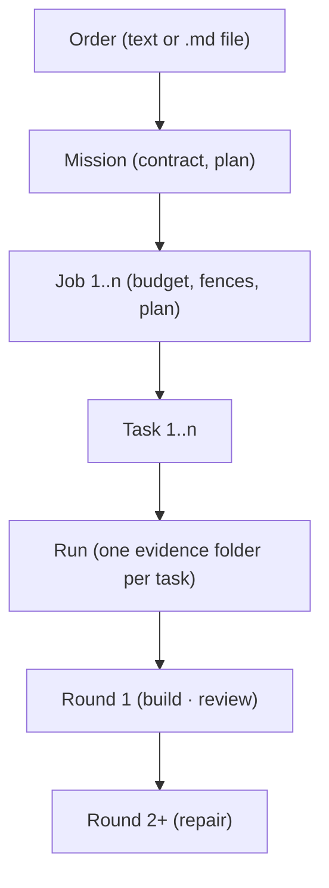

STEP T001-C / F259 — Vocabulary & concept model v1 — round 3 of session 1
BRANCH feature/f259-vocabulary, head e726832e at the time this block was written.

Goal
  Finish T001. Append two sections to `docs/system/vocabulary.md`: the
  do-not-confuse table, carrying exactly the pairs T2_F259.md names, and the
  concept model — the Mermaid diagram plus a short plain-language walk-through of
  it. Book the reviewer's PASS verdict on round 2 and one reviewer prose slip.
  The Mermaid block is the SAME text that round 6 puts into `README.md`; this
  round therefore takes it byte-for-byte from `docs/roadmap/features/T2_F259.md`
  and gates it against that source, so the two copies cannot drift.

Bundle, in this order (one commit each)
  C0a save the block file to .agent/authored/f259-r3.md (copy, never retype)
  C0b mirror it to .agent/last_block.md
  C1  .agent/plan.md ← PLANF259R3 (whole rewrite)
  C2  .agent/live_review.md: GATE_R2 appended at end of file;
      .agent/prose_slips.md: SLIP3 appended. One commit — both are this round's
      booking of the round-2 verdict.
  C3  docs/system/vocabulary.md: append PAGE2 (see "The page append" below)
  then push; run the gates
  C4  rewrite .agent/handoff.md; push again.

  Create NO pull request. F259's pull request belongs to its closure round.

Change set — EXACTLY these paths and nothing else
  .agent/authored/f259-r3.md (C0a) — .agent/last_block.md (C0b) —
  .agent/plan.md (C1) — .agent/live_review.md, .agent/prose_slips.md (C2) —
  docs/system/vocabulary.md (C3) — .agent/handoff.md (C4)

Delivery — how this block reaches the repository
  The block is on disk, written by the reviewer, at
      .remedy-wt/f259-r3-block.md
  `.remedy-wt/` is gitignored (`.gitignore` line 235). C0a COPIES that file —
  `shutil.copyfile` or `cp`, never a retype — to .agent/authored/f259-r3.md, and
  C0b copies it to .agent/last_block.md. Every slice you apply is extracted from
  the COMMITTED .agent/authored/f259-r3.md by marker extraction in Python.

The authored slices. Each lies between its own one-line BEGIN and END marker;
the slice is the bytes between the BEGIN marker's newline and the newline before
the END marker, EXCLUDING that final newline. The marker lines themselves are
never applied to any file.

The page append (C3)
  `docs/system/vocabulary.md` ends with a newline (measured by the reviewer at
  e726832e: 10 608 bytes, final bytes ``under `apps/`.\n``). Append the bytes
      "\n" + PAGE2 + "\n"
  so one empty line separates the existing closing paragraph from the new
  `## Do not confuse these` heading. Nothing already in the file changes: the
  gate proves it by showing the pre-append bytes are a byte-exact PREFIX of the
  post-append bytes.

The record append (C2)
  `.agent/live_review.md` ends with a newline. Append
      "\n" + GATE_R2 + "\n"
  which is the file's existing convention — records at end of file, one empty
  line between them.

The prose-slip append (C2)
  `.agent/prose_slips.md` does NOT end with a newline (measured at e726832e:
  76 469 bytes, final byte `.`). Append
      "\n\n" + SLIP3
  and add NO trailing newline.

Constraints
  1. Every slice is applied BYTE FOR BYTE from the committed
     .agent/authored/f259-r3.md by marker extraction in Python. You may not
     improve, rewrap, re-punctuate or shorten a slice, and you may not fix an
     error you find in one: apply it as written and declare the problem in the
     handback's deviations. The reviewer owns this text.
  2. THE MERMAID BLOCK IS NOT YOURS TO NORMALISE. PAGE2 contains a fenced
     ```mermaid block whose body must end up byte-identical to the body of the
     single fenced mermaid block in `docs/roadmap/features/T2_F259.md`. It uses
     four-space indentation and contains the character U+00B7 MIDDLE DOT in
     `Round 1 (build · review)`. Do not re-indent it, do not convert that
     character, do not let an editor touch it — extract and write bytes.
  3. Read `.agent/STOP` from disk before C0a, before C3 and before C4. If it
     exists, finish the commit in hand, write the handback saying so, push, and
     stop.
  4. NEWLINE CONVENTIONS: PLANF259R3 replaces `.agent/plan.md` whole and ends
     with exactly one trailing newline; PAGE2 and GATE_R2 are appended as
     described above; SLIP3 is ONE line and the appended region ends with NO
     newline.
  5. This session's shell guard refuses some command FORMS outright — shell
     loops, `$(...)` substitution, `$?` in a compound command, a `$` anchor
     inside a `grep -c` pattern, brace-with-quote literals in a heredoc, and a
     non-ASCII character inside a Python bytes literal. Re-express the check in
     Python (`python3 -c`, or a script under the gitignored `.remedy-wt/`) and
     report the Python you ran beside its output, with the refusal quoted
     verbatim. No gate is dropped or narrowed because a form was refused.
  6. Commit subjects are `f259: <what>`. No leading-slash token, no absolute
     path. End every commit message with the trailer
     `Co-Authored-By: Claude Opus 5 <noreply@anthropic.com>`.
  7. AGENTS.md binds you in full: the self-review loop before EVERY commit, the
     Commit Gate, the branch never being `main`, `git push -u origin
     feature/f259-vocabulary`. Never `--force`, never a history rewrite, never
     `gh pr merge`, never a branch deletion.
  8. Do-not-touch, from T2_F259.md: no command is renamed, no module is moved,
     no data shape changes, no catalog description is edited. Registering the
     page in `docs/README.md` and writing the diagram into `README.md` are round
     6's work (T004) — do not do either early.

Done when — the gates. Real exit codes, real output, one line per gate in the
handback. Every gate runs at or before C3; none is ordered after the commit that
writes the handback.

  G1 TRANSPORT. `sha256sum .remedy-wt/f259-r3-block.md .agent/authored/f259-r3.md .agent/last_block.md`
     — one digest, three times. Report the digest and all three paths.
  G2 THE PAGE APPEND, proved by reconstruction rather than by counting. Report
     both booleans: the pre-append bytes of `docs/system/vocabulary.md` are a
     byte-exact PREFIX of the post-append bytes; and the post-append bytes equal
     the pre-append bytes plus exactly `"\n" + PAGE2 + "\n"`. Report the file's
     byte length before and after.
  G3 THE DIAGRAM CANNOT DRIFT. Extract the body of the single fenced
     ```mermaid block from `docs/roadmap/features/T2_F259.md` and the body of the
     single fenced ```mermaid block from `docs/system/vocabulary.md`, and report
     the sha256 of each. They must be equal, and equal to
         6f6d59ee6f3d2b36525d64596b04fee3f5ce43d2c439367e6e40c613d313e07c
     which the reviewer measured over the feature file's block at e726832e (309
     bytes, seven lines). Report the byte length and line count your own
     extraction measured. Then run a NEGATIVE CONTROL on a COPY of the page under
     `.remedy-wt/`: change the middle dot in `Round 1 (build · review)` to a
     hyphen and confirm the two digests then DIFFER — a comparison that cannot
     fail proves nothing when it passes.
  G4 THE DO-NOT-CONFUSE TABLE ROWS THE RIGHT PAIRS. Extract the first cell of
     every row of the page's do-not-confuse table, in file order, strip the bold
     markers, and report that list together with the length your extraction
     measured. It must equal, in order, the pairs T2_F259.md's Goal & Done names:
     `Job / Run`, `Plan / Roadmap`, `Order / Job`, `Task / Round`,
     `Contract / permissions`, `Mission / schedule`, `Worker / role`,
     `template / order file`. Report also that every row of that table splits
     into the same number of cells as its header row — a stray unescaped pipe
     silently eats a column.
  G5 THE RECORD AND THE SLIP APPENDS. For `.agent/live_review.md`: the
     pre-append bytes are a byte-exact PREFIX of the post-append bytes and the
     remainder equals exactly `"\n" + GATE_R2 + "\n"` — report both booleans —
     and `grep -c '^Gate: R2 — ' .agent/live_review.md` goes from 0 to 1. For
     `.agent/prose_slips.md`: the same prefix property, the remainder equal to
     `"\n\n" + SLIP3`, and the file still does not end with a newline. Report
     the byte length of each file before and after.
  G6 THE SUITES, RUN SERIALLY, at C3. Each is a real run; report the passed
     count and exit code for each. The expected counts were re-measured by the
     reviewer at e726832e, this branch's head before this round:
       python3 -m pytest tests/docs/ -q                                 expect 295
       python3 -m pytest tests/orchestration/test_roadmap_index.py -q   expect 30
       python3 -m pytest tests/ui_server/ -q                            expect 515
       python3 -m pytest tests/orchestration/test_test_runner.py -q     expect 52
       python3 -m pytest tests/regression/test_resource_safety.py -q    expect 21
       python3 -m pytest tests/orchestration/test_integrity_gate.py -q  expect 16
       python3 -m pytest tests/cli/test_golden_path.py -q               expect 42
     The four state readers are run as four, not as three. A count that comes
     back different is not rounded off or explained away: report the number and
     the failing node ids verbatim.
  G7 THE PLAN AND THE STRUCTURE. `wc -l .agent/plan.md` under 50; one `## Goal`
     heading and one `## Next Steps` heading (report both counts); the file
     equals the extracted PLANF259R3 slice plus one trailing newline under
     `filecmp.cmp(..., shallow=False)` — report the boolean. Then:
     `git status --porcelain` empty immediately before C4 is staged and again
     after the final push; `git ls-files .remedy-wt` returns nothing (report the
     line count); every commit single-parent; and `git diff --numstat <parent>
     <commit>` for EACH commit C0a through C3, reported cell by cell so the
     handback's `## Commits` table carries the same numbers this gate printed.
     Report each commit's insertion count against the 500 cap. Report the push
     result and confirm no pull request was created.

The handback (C4) — rewrite .agent/handoff.md whole
  No length cap. It must carry: the feature, the round and the SESSION NUMBER —
  still SESSION 1 of F259, round 3, rounds so far 3; the commit range; a
  `## Commits` table with one row per commit giving the files and the `+/-`
  numbers G7 printed; the item-status table AGENTS.md requires, one row per
  bundle item C0a through C4; one line per gate G1 through G7 with its real
  reading; the deviations and assumptions; ONE sentence of context
  self-assessment (operator amendment amend0905-throughput); and the next
  expected action, which is the reviewer's gate of this round and then round 4,
  T002 — the DECISION paragraphs onto the page. Repeat this line verbatim in its
  state block:
  `~40 % (T001 ✅ komplett · T002, T003, T004 offen) — Schätzung`

<<<BEGIN PLANF259R3>>>
# Plan — F259 Vocabulary & concept model v1

Branch: feature/f259-vocabulary, cut from `main` at 25961794. Rounds 1 and 2
PASSED the reviewer's gate; the round-2 verdict is booked in
`.agent/live_review.md` by round 3's own C2, which is where a verdict lands
under operator amendment amend0827-process-diet rule 1.

## Goal

Write `docs/system/vocabulary.md` as the BINDING vocabulary page: the DECISION
amend0905-vocab D1 table — one row per word, with its meaning, its code spelling
today, its code spelling after F260/F261, its CLI spelling and what it is NOT —
plus the do-not-confuse table, the Mermaid concept diagram, and D2–D10 and F259
D1/D2 as dated DECISION paragraphs. Pin the page with
`tests/docs/test_vocabulary.py` in planned mode against the shipped
`apps/cli/command_catalog.py`, put the same Mermaid block into `README.md`, and
register the page in `docs/README.md`. Explicitly no other code: F259 decides
words, F260 and F261 spend them.

## Current Step

Round 3 completes T001 — the do-not-confuse table and the concept model are
appended to the page, the Mermaid block taken byte-for-byte from
`docs/roadmap/features/T2_F259.md` so that round 6's copy in `README.md` cannot
drift from it; the round-2 verdict and one reviewer prose slip are booked.

## Next Steps

- Write DECISION amend0905-vocab D2–D10 and F259 D1/D2 onto the page as dated
  paragraphs, and check `T2_F263.md`'s heading for a working name (T002).
- Write `tests/docs/test_vocabulary.py` in planned mode with both of the red
  proofs T2_F259.md's T003 names.
- Put the Mermaid block into `README.md` and register the page in
  `docs/README.md` (T004).
- Run the integration gate, then the closure sequence.

## Risks

- The Mermaid block now exists in two places and will exist in three; only a
  byte-comparison gate keeps them equal, and every round that touches either
  file re-runs it.
- `README.md` has a guarded region: its `Accepted in Tier 2 so far:` block is
  scanned for feature ids, and putting an unaccepted id there is what R-0797
  was. Round 6 writes into that file and must add no id token.
<<<END PLANF259R3>>>

<<<BEGIN GATE_R2>>>
Gate: R2 — the F259 R2 entry. R2 CREATED THE VOCABULARY PAGE WITH ITS BINDING PREAMBLE AND THE D1 TABLE. VERDICT PASS. Range 85b0e8b5..e726832e, six commits, all single-parent, pushed, no pull request. Largest commit 326 insertions, so the C0a/C0b split this record's R1 entry made binding on every later F259 block held and no commit approached the AGENTS.md 500-insertion cap. The reviewer re-ran every gate itself. TRANSPORT: one digest `e70d84ebe4e516a685a293ef820e2a813d5ba095c24370570fb3c33a2de3e27a` across `.remedy-wt/f259-r2-block.md`, `.agent/authored/f259-r2.md` and `.agent/last_block.md`, equal to the digest the reviewer computed over its own scratch file before emission; per §3 item 37 that is a COPY chain covering scratch, saved copy and mirror, and is not a claim about bytes emitted into a prompt. THE C2 EDITS WERE PROVED BY TOTAL RECONSTRUCTION rather than by the counting the block ordered: the reviewer rebuilt the post-commit `.agent/live_review.md` from its parent as parent-with-one-newline-inserted-before-`## Findings` plus `"\n" + GATE_R1 + "\n"`, and the reconstruction is byte-EQUAL to what 07bc4194 committed, which establishes both that the blank line landed and that nothing else in the 816 KB record moved. `.agent/prose_slips.md` likewise equals its parent plus exactly `"\n\n" + SLIP1 + "\n\n" + SLIP2`, still ends with no newline, and grew 74 550 to 76 469 bytes. THE PAGE: `docs/system/vocabulary.md` at da1a708a is byte-equal to the authored VOCABPAGE slice plus one trailing newline, extracted from the COMMITTED authored file; its table carries 15 rows whose first cells are, in order, Project, Order, Mission, Contract, Job, Plan, Task, Run, Round, Worker, Decision, Evidence, Gate, Verdict, Roadmap — the DECISION amend0905-vocab D1 order exactly — and every row splits into the same number of cells. `.agent/plan.md` is byte-equal to its slice plus one newline at 46 lines. THE PAGE'S CLAIMS RESOLVE: the reviewer re-ran its own checker over the LANDED file and measured 11 distinct module paths, all resolving on disk, and 70 backticked identifiers, every one occurring in a module named in its own table cell, with a negative control renaming one identifier and correctly reporting exactly one failure. OPEN SET, recomputed mechanically per §3 item 10: 299 registrations against 5 `Done:` lines, 294 open, unchanged by this round, which registered nothing. SUITES, re-run by the reviewer serially and all exact: `tests/docs/` 295, `tests/orchestration/test_roadmap_index.py` 30, `tests/ui_server/` 515, `tests/orchestration/test_test_runner.py` 52, `tests/regression/test_resource_safety.py` 21, `tests/orchestration/test_integrity_gate.py` 16, `tests/cli/test_golden_path.py` 42. THE WORKER CORRECTLY REFUSED AN UNMEETABLE GATE: the block's G2 demanded that after the blank-line repair `\n## Findings\n` count 0 and `\n\n## Findings\n` count 1, and the first is impossible because the second string CONTAINS the first, so a substring count over the repaired file necessarily reads 1 and 1. The worker reported the true pair, named the non-overlapping reading under which the sentence means what it says, and adjusted nothing — the honest response, and the reviewer's arithmetic error is recorded in `.agent/prose_slips.md` by the same commit that appends this entry. The worker also reported that the block's G4 attribution heuristic flagged `contract.inspect`, `contract.check` and `contract.set`, whose cell names the catalog in prose without backticking its path; the reviewer confirmed at e726832e that all three are real command ids in `apps/cli/command_catalog.py`, at lines 4452, 4465 and 4481, so the page is correct and only the heuristic was coarse. Neither is a defect with product effect under operator amendment amend0827-process-diet rule 2, and no R-id is spent.
<<<END GATE_R2>>>

<<<BEGIN SLIP3>>>
2026-09-05 · F259 R2 (reviewer) · The round-2 block's gate G2 ordered, for the blank-line repair of `.agent/live_review.md`, the counts of `\n## Findings\n` and `\n\n## Findings\n` to read 1 and 0 before and 0 and 1 after — and the "0 after" is unreachable for every possible round, because the second string CONTAINS the first, so any substring count of the first over the repaired file reads at least 1. The reviewer wrote the pair as though inserting a newline REPLACED the shorter match rather than extending it. THE LESSON: a gate that counts one string before and after an edit that lengthens a neighbouring string is checked by running the count on the POST-EDIT bytes at authoring time, which the block already had to construct in order to state the expectation at all; the alternative that has no such failure mode is to gate the edit by TOTAL RECONSTRUCTION — assert the post-commit file equals the parent with exactly the ordered transformation applied — which is what the reviewer used at the gate and what every later F259 block orders for a whole-file edit. Reviewer-authored arithmetic slip in a gate; the worker reported the true counts and adjusted nothing, and nothing on disk under `packages/`, `apps/`, `tests/` or `docs/` is wrong; no R-id spent (amend0827-process-diet rule 2).
<<<END SLIP3>>>

<<<BEGIN PAGE2>>>
## Do not confuse these

Most of what this page exists to end was never someone failing to define a word.
It was two words for one thing, or one word for two things.

| Not the same | The difference | Why they get confused |
|---|---|---|
| **Job / Run** | A Job is the administrative unit — identity, budget, fences, permissions, a plan. A Run is one execution of the loop for one Task, owning one evidence folder. One Job has many Runs. | Both carry an id and a status, and the command `job run` reads as though the job were the thing that runs. |
| **Plan / Roadmap** | A Plan is what Remedy will do for a mission or a job. The Roadmap is Remedy's OWN build plan under `docs/roadmap/`, a developer artefact no user ever sees. | The CLI today spells the roadmap mirror `plan status` and `plan next`, which is the sharpest collision in the tree; DECISION amend0905-vocab D6 moves it to the hidden group `roadmap`. |
| **Order / Job** | The Order is what the human gives Remedy. The Job is what Remedy makes of it. Input against response. | The order arrives as a file and the job is parsed straight out of it, so one phrase — "job file" — has been naming both ends at once. |
| **Task / Round** | A Task is one step of a job plan. A Round is one pass inside a single Run of a single Task: build, then tests, then review. A task that fails takes a second Round, never a second Task. | Both are counted and both are capped, and casual prose calls either one a "step". |
| **Contract / permissions** | The Contract is what the mission must ACHIEVE — acceptance criteria compiled to checks. Permissions and fences are what Remedy is ALLOWED TO DO while trying. Goal against boundary. | The catalog's `contract` group today is the permission object, not the acceptance criteria, so the word currently points at the wrong one of the two. |
| **Mission / schedule** | A Mission is one order and everything that came of it. It has no recurrence and no clock. | `remedy loop` and the `overnight` group made recurrence look like a property of a mission; DECISION amend0905-vocab D7 deletes both, and a recurring order becomes an order file started by hand. |
| **Worker / role** | A Worker is a model IN a role. The role is Builder, Reviewer, Planner or Teacher; the worker is whichever model is bound to that role for this task. | Reports have printed "Worker: fake", which names the provider in the place a reader expects the role. |
| **template / order file** | A template is a CONTRACT template — website, api-service, cli-tool, python-library — proposed by the planner or forced with `--contract`. An order file is a Markdown file holding one human's order, started with `remedy do <file>`. | Both are files you keep in the repo and hand to Remedy, and the deleted `loop` tables called order files templates. |

## The concept model



In words, for a first read. You give Remedy an **Order** — a sentence, or a
Markdown file. Remedy turns it into a **Mission**, the record of that order,
which holds the **Contract**: the acceptance criteria the finished work must
meet. The mission is carried out by one or more **Jobs**, and each job has its
own budget, its fences and its own **Plan** — and that plan is a list of
**Tasks**. Each task is executed by exactly one **Run**, which owns exactly one
evidence folder. Inside a run the work happens in **Rounds**: round 1 builds and
reviews, and every later round repairs.

Everything above the Run is bookkeeping. The Run is where a model actually
writes code, and the evidence folder it leaves behind is what you read
afterwards to see what happened.
<<<END PAGE2>>>
