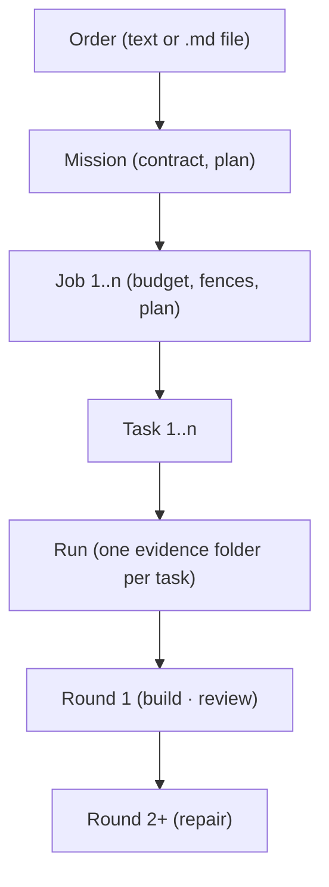

STEP T004 / F259 — Vocabulary & concept model v1 — round 6 of session 1
BRANCH feature/f259-vocabulary, head cc8834bf at the time this block was written.

Goal
  T004, the last build round. Put the Mermaid concept diagram into `README.md`
  directly under the one-sentence description, byte-equal to the page's;
  register `docs/system/vocabulary.md` in `docs/README.md`'s Quick-Find table and
  its System table; and extend `tests/docs/test_vocabulary.py` with the pin that
  keeps the README copy and the page copy byte-equal, with a red proof. Book the
  reviewer's PASS verdict on round 5 and three reviewer prose slips.

  After this round F259's build work is complete and only the integration gate
  and the closure sequence remain.

Finding R-0797 binds this round (docs/agents/planner_reviewer_prompt.md §3 item 34)
  R-0797's resolution states that its ROOT CAUSE is undischarged and binds every
  later block writing into a guarded region of `README.md`: item 34 was applied
  to the DIRECTION of a test's pin instead of to the TOKENS a slice would place
  inside the guarded block. `README.md` carries four `Accepted in Tier N so far:`
  blocks which `tests/docs/test_docs_consistency.py::TestPrimaryDocsAreHonest::test_the_readme_reports_the_accepted_foundation_and_no_later_feature`
  scans for `F\d{3}` tokens, asserting each is `[x]` in `docs/roadmap/STATUS.md`.
  The reviewer measured them at cc8834bf: 31 ids, every one `[x]`. Gate G4 below
  reads those TOKENS, not merely that the test passes, and the change set inserts
  the diagram far above the first such block. No slice in this round contains an
  `F\d{3}` token bound for `README.md`.

Bundle, in this order (one commit each)
  C0a save the block file to .agent/authored/f259-r6.md (copy, never retype)
  C0b mirror it to .agent/last_block.md
  C1  .agent/plan.md ← PLANF259R6 (whole rewrite)
  C2  .agent/live_review.md: GATE_R5 appended at end of file;
      .agent/prose_slips.md: SLIP5, SLIP6 and SLIP7 appended. One commit.
  C3  README.md: insert the diagram (see "The README insertion" below)
  C4  docs/README.md: apply the two index pairs (see "The index pairs" below)
  C5  tests/docs/test_vocabulary.py: add the README pin, per the SPEC below
  then push; run the gates, including the red proof
  C6  rewrite .agent/handoff.md; push again.

  Create NO pull request. F259's pull request belongs to its closure round.

Change set — EXACTLY these paths and nothing else
  .agent/authored/f259-r6.md (C0a) — .agent/last_block.md (C0b) —
  .agent/plan.md (C1) — .agent/live_review.md, .agent/prose_slips.md (C2) —
  README.md (C3) — docs/README.md (C4) — tests/docs/test_vocabulary.py (C5) —
  .agent/handoff.md (C6)

Delivery — how this block reaches the repository
  The block is on disk, written by the reviewer, at
      .remedy-wt/f259-r6-block.md
  `.remedy-wt/` is gitignored (`.gitignore` line 235). C0a COPIES that file to
  .agent/authored/f259-r6.md and C0b copies it to .agent/last_block.md. Every
  slice is extracted from the COMMITTED .agent/authored/f259-r6.md by marker
  extraction in Python.

The authored slices lie between one-line BEGIN and END markers; the slice is the
bytes between the BEGIN marker's newline and the newline before the END marker,
EXCLUDING that final newline. The marker lines are never applied to any file.

The README insertion (C3)
  Exactly one occurrence of this anchor exists in `README.md` (the reviewer
  counted it at cc8834bf, where the file is 13 893 bytes and ends with a
  newline):
      reaches your repository or your remote without you saying so.\n\n**Local-first.**
  Replace that ONE occurrence with the same text carrying the diagram between
  the paragraph and the `**Local-first.**` line: that is, the first line, then a
  blank line, then READMEBLOCK, then a blank line, then `**Local-first.**`.
  Assert the anchor count is 1 before and 0 after — after the edit the anchor
  string no longer occurs, because the diagram now sits inside it.
  READMEBLOCK is a fenced ```mermaid block. Its BODY — the bytes between the
  opening fence's newline and the newline before the closing fence — must be
  byte-identical to the body of the single fenced mermaid block already in
  `docs/system/vocabulary.md` and in `docs/roadmap/features/T2_F259.md`, whose
  sha256 under that convention is
      6f6d59ee6f3d2b36525d64596b04fee3f5ce43d2c439367e6e40c613d313e07c
  at 309 bytes and seven lines. It uses four-space indentation and contains
  U+00B7 MIDDLE DOT. Extract and write BYTES; do not re-indent it and do not
  normalise that character.

The index pairs (C4)
  Two FROM/TO pairs against `docs/README.md`, each applied with
  `str.replace(FROM, TO, 1)` after confirming the FROM occurs EXACTLY ONCE.
  The reviewer ran the containment test on both before emission and it printed
  `TO contains FROM: true` for each, so BOTH are APPEND-shaped: the obligation
  is FROM exactly 1x afterwards plus the new line exactly 1x among the lines
  that commit's diff ADDS — never a FROM-zero count, which is unattainable for
  an append and is how a mislabelled pair puts a false number in the record.
  QUICKFIND inserts the row into the Quick-Find table between the `UI` row and
  the `watchdog` row, where `vocabulary` sorts. SYSTABLE inserts the row into
  the System Documentation table between the `token-economy-...` row and the
  `worker.md` row, where `vocabulary.md` sorts.

The record append (C2)
  `.agent/live_review.md` ends with a newline. Append `"\n" + GATE_R5 + "\n"`.

The prose-slip append (C2)
  `.agent/prose_slips.md` does NOT end with a newline (measured at cc8834bf).
  Append `"\n\n" + SLIP5 + "\n\n" + SLIP6 + "\n\n" + SLIP7` and add NO trailing
  newline.

Constraints
  1. Every slice is applied BYTE FOR BYTE from the committed
     .agent/authored/f259-r6.md by marker extraction in Python. You may not
     improve, rewrap, re-punctuate or shorten a slice, and you may not fix an
     error you find in one: apply it verbatim and declare the problem in the
     handback's deviations.
  2. THE DIAGRAM IS NOT YOURS TO NORMALISE. See the README insertion above.
  3. THE ADDITION TO `tests/docs/test_vocabulary.py` IS PRODUCTION CODE AND IS
     YOURS TO WRITE, to the SPEC below. No slice is shipped for it. Add only
     what the SPEC describes; change no existing test in that file and do not
     touch `VOCABULARY_MODE`.
  4. Read `.agent/STOP` from disk before C0a, before C3 and before C6.
  5. NEWLINE CONVENTIONS: PLANF259R6 replaces `.agent/plan.md` whole with
     exactly one trailing newline; the record append is as described; the
     prose-slip append ends with NO newline; `README.md`, `docs/README.md` and
     `tests/docs/test_vocabulary.py` each still end with exactly one newline
     after their edits.
  6. DESTRUCTIVE VERIFICATION IS ISOLATED. The red proof runs ONLY inside a
     disposable `git worktree` created from this branch's head, never in the
     primary checkout. Purge `__pycache__` under the worktree and invoke
     `python3 -B -m pytest`. Report the unmutated control beside the mutated run,
     and print `apps.cli.command_catalog.__file__` and the test's resolved
     `REPO` from inside the worktree so it is proved to be reading itself.
     Remove and prune the worktree afterwards and show `git worktree list`; the
     ten pre-existing `remedy/job-*` worktrees are not yours and stay.
  7. This session's shell guard refuses some command FORMS outright — shell
     loops, `$(...)` substitution, `$?` in a compound command, `${PIPESTATUS[0]}`,
     a `$` anchor inside a `grep -c` pattern, brace-with-quote literals in a
     heredoc, and a non-ASCII character in a Python bytes literal. Re-express in
     Python and report the Python you ran beside its output, with any refusal
     quoted verbatim. No gate is dropped or narrowed for a refused form.
  8. `ruff check` is denied to this session — to the worker as well as the
     reviewer, as round 5 measured. Attempt it on the changed test file, report
     the exact refusal or output, and run `python3 -m py_compile` either way.
  9. Commit subjects are `f259: <what>`. No leading-slash token, no absolute
     path. End every commit message with the trailer
     `Co-Authored-By: Claude Opus 5 <noreply@anthropic.com>`.
 10. AGENTS.md binds you in full. Never `--force`, never a history rewrite,
     never `gh pr merge`, never a branch deletion. C6 is ONE commit and reports
     no reading that only exists after it is pushed.
 11. Do-not-touch: no command is renamed, no module is moved, no data shape
     changes, no catalog description is edited. NOTHING in this round edits any
     `Accepted in Tier N so far:` block of `README.md`, and no slice bound for
     `README.md` contains an `F\d{3}` token.

SPEC — the addition to tests/docs/test_vocabulary.py (production code)

  Add a module-level constant for the README path beside the existing `PAGE` and
  feature-file constants, in the same style.

  Add ONE test, named for what it pins, in the file's existing naming idiom
  (`test_the_readme_...`). It asserts:
  - `README.md` holds EXACTLY ONE fenced ```mermaid block; and
  - that block's body is BYTE-EQUAL to the body of the single fenced mermaid
    block in `docs/system/vocabulary.md`.
  Reuse the file's existing `_mermaid_body` helper rather than writing a second
  extractor — two extractors with different conventions is the drift this test
  exists to prevent. The assertion message names both paths and says that the
  two copies must be edited together.

  This test holds in BOTH modes and is not decorated with anything.

Done when — the gates. Real exit codes, real output, one line per gate in the
handback. Every gate runs at or before C5; none is ordered after the commit that
writes the handback.

  G1 TRANSPORT. `sha256sum .remedy-wt/f259-r6-block.md .agent/authored/f259-r6.md .agent/last_block.md`
     — one digest, three times. Report it and all three paths.
  G2 THE README INSERTION, proved by reconstruction. Report: the anchor count in
     `README.md` before (1) and after (0); and the boolean that the post-commit
     bytes equal the pre-commit bytes with that ONE occurrence replaced by the
     ordered replacement — nothing else in the file differs. Report the byte
     length before and after. Then report the sha256 of the body of README's
     single fenced mermaid block; it must equal
     6f6d59ee6f3d2b36525d64596b04fee3f5ce43d2c439367e6e40c613d313e07c and must
     equal the same reading taken from `docs/system/vocabulary.md` and from
     `docs/roadmap/features/T2_F259.md`. Report all three digests.
  G3 THE INDEX PAIRS. For EACH pair: the FROM count before (1); the containment
     reading printed by your own test, in the words `TO contains FROM: true` or
     `false`, with the APPEND or REWRITE label derived from that output on the
     same line; the FROM count after (1, because both are appends); and the count
     of the new row's text among the lines `git show --numstat` reports that
     commit as ADDING (1 each). Then report that `docs/README.md` contains the
     string `system/vocabulary.md` exactly twice and that the file's table rows
     are otherwise unchanged, by showing that the post-commit bytes equal the
     pre-commit bytes with exactly those two replacements applied.
  G4 THE GUARDED README REGION — FINDING R-0797's BINDING CLAUSE. Extract every
     `Accepted in Tier N so far:` block from `README.md` AFTER C3 and report:
     the number of blocks, the full sorted list of `F\d{3}` tokens inside them,
     and for each token whether `docs/roadmap/STATUS.md` carries it as `- [x]`.
     Every one must be `[x]`; report the full list, never a summary count alone.
     Additionally report that those blocks' bytes are IDENTICAL before and after
     C3. Then run
     `python3 -m pytest tests/docs/test_docs_consistency.py -q` and report its
     passed count and exit code.
  G5 THE TEST IS GREEN AND THE DOCS SUITE GREW BY ONE.
     `python3 -m pytest tests/docs/test_vocabulary.py -q` — report the passed
     count and exit code; it was 7 at cc8834bf and this round adds one test.
     `python3 -m pytest tests/docs/ -q` — report the passed count and exit code;
     it was 302 at cc8834bf, so state the arithmetic explicitly against the
     number the first command reported rather than a number this block guesses.
  G6 THE RED PROOF OF THE NEW PIN, in a disposable worktree, with its unmutated
     control. Constraint 6 governs how. Report, for each of the three runs, the
     exit code, the passed/failed counts and the failing node ids:
       (control) unmutated worktree — must be exit 0.
       (mutation) in the WORKTREE's `README.md` only, change the diagram body —
         name the exact byte you changed and quote the line before and after —
         and re-run: the new README pin test must FAIL, and no other test may
         fail, because only README moved. Report which tests failed.
       (control again) restore, re-run, exit 0, and confirm the worktree's
         README is byte-identical to before the mutation.
     Report `apps.cli.command_catalog.__file__` and the resolved `REPO` from
     inside the worktree runs. Finish with `git worktree list` showing your
     scratch worktree gone and `git status --porcelain` empty in the primary
     checkout.
  G7 THE RECORD AND THE SLIPS, AND THE SUITES. For `.agent/live_review.md`: the
     pre-append bytes are a byte-exact PREFIX of the post-append bytes, the
     remainder equals exactly `"\n" + GATE_R5 + "\n"`, and
     `grep -c '^Gate: R5 — ' .agent/live_review.md` goes from 0 to 1. For
     `.agent/prose_slips.md`: the same prefix property, the remainder equal to
     `"\n\n" + SLIP5 + "\n\n" + SLIP6 + "\n\n" + SLIP7`, and the file still not
     ending with a newline. Report byte lengths before and after for both. Then
     the suites, run serially at C5, each a real run with its passed count and
     exit code; expected counts re-measured by the reviewer at cc8834bf:
       python3 -m pytest tests/orchestration/test_roadmap_index.py -q   expect 30
       python3 -m pytest tests/ui_server/ -q                            expect 515
       python3 -m pytest tests/orchestration/test_test_runner.py -q     expect 52
       python3 -m pytest tests/regression/test_resource_safety.py -q    expect 21
       python3 -m pytest tests/orchestration/test_integrity_gate.py -q  expect 16
       python3 -m pytest tests/cli/test_golden_path.py -q               expect 42
     The four state readers are run as four. `tests/docs/` is covered by G4 and
     G5 and is not repeated. A different count is reported as the number it is,
     with failing node ids verbatim.
  G8 THE PLAN AND THE STRUCTURE. `wc -l .agent/plan.md` under 50; one `## Goal`
     and one `## Next Steps` (report both counts); `filecmp.cmp(..., shallow=False)`
     True against the slice plus one newline. Then `python3 -m py_compile
     tests/docs/test_vocabulary.py` and the `ruff check` attempt of constraint 8;
     `git status --porcelain` empty immediately before C6 is staged;
     `git ls-files .remedy-wt` returns nothing; every commit single-parent;
     `git diff --numstat <parent> <commit>` for EACH commit C0a through C5
     reported cell by cell, so the handback's `## Commits` table carries the same
     numbers; each commit's insertion count against the 500 cap; the push result;
     and confirmation that no pull request was created.

The handback (C6) — rewrite .agent/handoff.md whole
  No length cap. Carry: feature, round, SESSION NUMBER — still SESSION 1 of
  F259, round 6, rounds so far 6; the commit range; a `## Commits` table with the
  `+/-` numbers G8 printed; the AGENTS.md item-status table, one row per bundle
  item C0a through C6; one line per gate G1 through G8 with its real reading; the
  full red-proof transcript of G6; the deviations; ONE sentence of context
  self-assessment; and the next expected action — the reviewer's gate, then the
  INTEGRATION GATE round per docs/agents/integration_gate.md, then closure.
  Repeat this line verbatim in its state block:
  `~90 % (T001 ✅ · T002 ✅ · T003 ✅ · T004 ✅ · Integration Gate + Closure offen) — Schätzung`

<<<BEGIN PLANF259R6>>>
# Plan — F259 Vocabulary & concept model v1

Branch: feature/f259-vocabulary, cut from `main` at 25961794. Rounds 1 to 5
PASSED the reviewer's gate; the round-5 verdict is booked in
`.agent/live_review.md` by round 6's own C2, which is where a verdict lands
under operator amendment amend0827-process-diet rule 1.

## Goal

Write `docs/system/vocabulary.md` as the BINDING vocabulary page: the DECISION
amend0905-vocab D1 table, the do-not-confuse table, the Mermaid concept diagram,
and D2–D10 and F259 D1/D2 as dated DECISION paragraphs. Pin the page with
`tests/docs/test_vocabulary.py` in planned mode against the shipped
`apps/cli/command_catalog.py`, put the same Mermaid block into `README.md`, and
register the page in `docs/README.md`. Explicitly no other code: F259 decides
words, F260 and F261 spend them.

## Current Step

Round 6 is T004, the last build round — the diagram into `README.md` under the
one-sentence description, byte-equal to the page's; the page registered in the
Quick-Find and System tables of `docs/README.md`; and the test extended with the
pin that keeps the two diagram copies equal, proved red by mutating README alone.

## Next Steps

- Run the integration gate per docs/agents/integration_gate.md: the full suite,
  a regression there is a normal repair round.
- Run the closure sequence per docs/roadmap/STATUS_closure_protocol.md: the
  evidence job, a FRESH review zip, the ledger rotation, the reviewer-authored
  STATUS line committed last, and the pull request — which is NOT merged in this
  session but at the next feature's Open PR Gate.

## Risks

- The Mermaid block now exists in three files. The new pin covers README against
  the page, and an existing test covers the page against the feature file, so
  every pair is pinned; a fourth copy would need a fourth pin.
- `README.md`'s `Accepted in Tier N so far:` blocks are scanned for feature ids
  and an unaccepted id there is what R-0797 was. This round inserts far above
  them, adds no id token, and gates the tokens themselves rather than only the
  test's direction.
<<<END PLANF259R6>>>

<<<BEGIN GATE_R5>>>
Gate: R5 — the F259 R5 entry. R5 WAS T003: THE DOCS TEST IN PLANNED MODE, WITH BOTH RED PROOFS. VERDICT PASS. Range 42448906..cc8834bf, seven commits, all single-parent, pushed, no pull request; largest commit 409 insertions. TRANSPORT: one digest `2e9aeaf94d5269d06473479693f71976d426ab4eb5e0b35c132f8e5db831ad67` across `.remedy-wt/f259-r5-block.md`, `.agent/authored/f259-r5.md` and `.agent/last_block.md`, equal to the digest the reviewer computed over its own scratch file before emission; per §3 item 37 that is a COPY chain covering scratch, saved copy and mirror. EVERY EDIT PROVED BY TOTAL RECONSTRUCTION: `.agent/live_review.md` equals its parent plus exactly `"\n" + GATE_R4 + "\n"` (830 738 to 834 169); `.agent/decisions.md` equals its parent plus exactly `"\n\n" + DECISION_D3`, still ending with no newline (833 794 to 836 338); `docs/system/vocabulary.md` equals its parent plus exactly `"\n" + MEANINGS + "\n"` (25 555 to 27 295); `.agent/plan.md` equals its slice plus one newline at 42 lines. The page's single mermaid body still hashes `6f6d59ee6f3d2b36525d64596b04fee3f5ce43d2c439367e6e40c613d313e07c`. THE SHIPPED TEST: `tests/docs/test_vocabulary.py`, 241 lines, imports `CATALOG` and `GROUPS` from `apps.cli.command_catalog` and carries zero occurrences of `--help`, `subprocess`, `capsys`, `skipif` or `pytest.mark.skip`, with exactly one module-level `VOCABULARY_MODE` assignment and the seven test functions the SPEC names. The reviewer ran it: 7 passed; `tests/docs/` reads 302, which is the 295 measured at 42448906 plus exactly those 7. THE RED PROOFS WERE RE-RUN BY THE REVIEWER INDEPENDENTLY, in its own disposable worktree at HEAD, `__pycache__` purged and `python3 -B -m pytest` with the worktree as working directory: the unmutated control is exit 0 at 7 passed; removing a binding word's row from the worktree's page — the reviewer chose `Gate`, a different word from the one the worker removed — is exit 1 with `test_the_word_table_carries_the_fifteen_binding_words_in_order` failing; setting `VOCABULARY_MODE = "enforced"` is exit 1 with `test_no_retired_synonym_reaches_the_catalog` AND `test_every_binding_word_in_a_description_carries_the_pages_meaning` failing; the restored control is exit 0 again, both mutated files byte-identical to their originals, the worktree removed and pruned, and the primary checkout's `git status --porcelain` empty. Each of the four runs printed `apps.cli.command_catalog.__file__` from inside the worktree and it resolved to the WORKTREE's own copy every time, which is the check that excludes the editable-install shadow — a worktree importing the primary checkout measures the wrong tree and fails silently. THE WORKER CORRECTED THREE REVIEWER ERRORS AND ADJUSTED NOTHING TO HIDE THEM. First, the SPEC gave a catalog argument a `description` attribute; `ArgDef`'s fields are `name`, `help`, `required`, `is_option`, `default`, `is_flag`, `is_repeatable`, so a literal reading raises `AttributeError`, and the worker read the dataclass, used `help`, and said so. Second, the block's G5 named only the synonym test as red under `enforced` while the meaning test flips by the same design, which the reviewer's own re-run confirms at two failures. Third, the reviewer's pre-emission simulation counted 242 meaning violations because it read the attribute that does not exist and therefore scanned empty strings; with `help` the true figures are 64 synonym offenders and 664 meaning violations, and the reviewer re-measured DECISION F259 D3's landed claims against the real field: `promote` in the descriptions of the `do` group, `do.promote` and `do.job-flow` and in the command ids `do.promote` and `do.job-promote` is EXACT, `flight plan` in `do.replan` alone is EXACT, `job-file` and `task-file` in two option names each are EXACT, so no landed claim is false — the one imprecision is that D3 calls six `overnight` surfaces "descriptions" where five are descriptions and one is a group label. SUITES, re-run by the reviewer serially and all exact: `tests/docs/` 302, `tests/orchestration/test_roadmap_index.py` 30, `tests/ui_server/` 515, `tests/orchestration/test_test_runner.py` 52, `tests/regression/test_resource_safety.py` 21, `tests/orchestration/test_integrity_gate.py` 16, `tests/cli/test_golden_path.py` 42. OPEN SET, recomputed mechanically per §3 item 10: 299 registrations against 5 `Done:` lines, 294 open, unchanged. POST-PUSH READINGS, taken by the reviewer per §3 item 31: `git status --porcelain` EMPTY, `git ls-files .remedy-wt` empty, `origin/feature/f259-vocabulary` at cc8834bf, `gh pr list --state open` returning `[]`. `ruff check` is denied to the WORKER as well as the reviewer, which round 5 established by attempting it; `python3 -m py_compile` exits 0. The three reviewer errors have no product effect under operator amendment amend0827-process-diet rule 2 — nothing under `packages/`, `apps/`, `tests/` or `docs/` is wrong, the shipped test measures the real field, and no gate over production code is blind — so no R-id is spent and all three are recorded in `.agent/prose_slips.md` by the same commit that appends this entry.
<<<END GATE_R5>>>

<<<BEGIN SLIP5>>>
2026-09-05 · F259 R5 (reviewer) · The round-5 SPEC told the worker to read, for each catalog argument, "the arg's `name` and `description`", and `ArgDef` has no `description` field — its fields are `name`, `help`, `required`, `is_option`, `default`, `is_flag` and `is_repeatable` — so a literal implementation raises `AttributeError`. Worse, the reviewer's own pre-emission simulation used `getattr(a, 'description', '')`, which silently returned the empty string for every argument, so the simulation scanned 1209 empty strings, reported 242 meaning violations, and looked green while measuring nothing. The worker read the dataclass, used `help`, documented the mismatch and reported the true figures (64 synonym offenders, 664 meaning violations). THE LESSON: §3 item 34 says every file a block orders a change against is READ at emission, and a dataclass whose FIELD NAMES a spec quotes is such a file; and a `getattr` with a default in a probe is a silent-pass mechanism — probe with attribute access or with `dataclasses.fields`, so a wrong name raises where it can still be fixed. Reviewer-authored spec error, corrected by the worker before it reached disk; the shipped test reads the real field and nothing on disk under `packages/`, `apps/`, `tests/` or `docs/` is wrong; no R-id spent (amend0827-process-diet rule 2).
<<<END SLIP5>>>

<<<BEGIN SLIP6>>>
2026-09-05 · F259 R5 (reviewer) · The round-5 block's gate G5 ordered red proof (b) as "`test_no_retired_synonym_reaches_the_catalog` must FAIL" when `VOCABULARY_MODE` is flipped to `enforced`, while the same block's own SPEC gives TWO mode-dependent tests that both invert under that flip — so the ordered property was narrower than the recipe it was ordered against, and an honest worker had to report an extra failure the gate did not predict. The reviewer's independent re-run confirms two failures. THE LESSON: §3 item 18 requires a probe's recipe and its stated property to be read against each other before emission, and where the recipe is "flip one constant" the property must enumerate every assertion that constant guards — which the block itself listed a page earlier. Reviewer-authored probe-property mismatch; the worker reported the true colour and adjusted nothing; no R-id spent (amend0827-process-diet rule 2).
<<<END SLIP6>>>

<<<BEGIN SLIP7>>>
2026-09-05 · F259 R5 (reviewer) · DECISION F259 D3, as landed in `.agent/decisions.md`, says the retired synonym `overnight` occurs "in six descriptions and as a group id". Re-measured against the real `ArgDef` field: the six surfaces are the `overnight` group's description, the `overnight` group's LABEL, and the descriptions of `overnight.readiness`, `overnight.contract-create`, `overnight.contract-show` and `overnight.contract-readiness` — five descriptions and one label, not six descriptions. The numeral six is right and the surface class is loose. Nothing follows from it: the decision's operative content is the SCOPE it fixes and the exclusion of `Worker:`, both unaffected, and the shipped test scans labels and descriptions alike. THE LESSON: when a claim counts SURFACES of more than one kind, name the kinds or name the count without a kind — "six catalog surfaces" would have been true as written. Landed in an append-only record and therefore NOT rewritten; this line is the dated correction. Reviewer-authored imprecision; no R-id spent (amend0827-process-diet rule 2).
<<<END SLIP7>>>

<<<BEGIN READMEBLOCK>>>

<<<END READMEBLOCK>>>

<<<BEGIN QUICKFIND_FROM>>>
| UI | [ui-target.md](archive/ui-target.md) | archive |
<<<END QUICKFIND_FROM>>>

<<<BEGIN QUICKFIND_TO>>>
| UI | [ui-target.md](archive/ui-target.md) | archive |
| vocabulary | [vocabulary.md](system/vocabulary.md) | system |
<<<END QUICKFIND_TO>>>

<<<BEGIN SYSTABLE_FROM>>>
| [worker.md](system/worker.md) | Worker architecture and guide |
<<<END SYSTABLE_FROM>>>

<<<BEGIN SYSTABLE_TO>>>
| [vocabulary.md](system/vocabulary.md) | The binding vocabulary: one row per word with its meaning, its code spelling today and after F260/F261, its CLI spelling and what it is NOT; the do-not-confuse table; the concept diagram; and the rulings that decided them |
| [worker.md](system/worker.md) | Worker architecture and guide |
<<<END SYSTABLE_TO>>>
