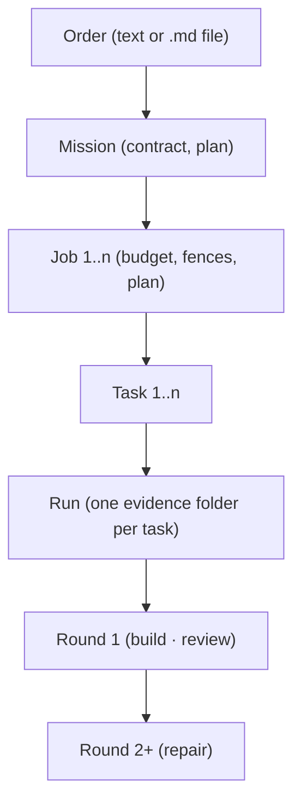

# Remedy

Remedy is a **local-first orchestration kernel** for artifact-driven software work.
It plans a job, runs it through a Builder / Reviewer loop inside an isolated git
worktree, collects verifiable evidence, and stops at a human approval gate. Nothing
reaches your repository or your remote without you saying so.



**Local-first.** Everything runs on your machine. Providers (Claude CLI, Ollama) are
optional plug-ins behind interfaces; the core has no cloud dependency.

**Human approval.** No automatic commit, push, merge or apply. Ever. The final
gate (`commit_execution_gate`) is `NEEDS_HUMAN_APPROVAL` by design.

**Evidence, not claims.** Every completion carries hashes, gates and reproducible
verification commands. If something is unproven, Remedy says so instead of guessing.

## Status

124 of 294 registered items accepted. Next: the first unchecked item in docs/roadmap/STATUS.md.

| Tier | Name | Done | Total |
|------|------|-----:|------:|
| 0 | Foundation & Trust Core | 16 | 16 |
| 1 | Self-Build Bootstrap | 22 | 22 |
| 2 | Minimal Self-Build Runtime | 41 | 42 |
| 3 | Full Token Economy & Autonomy | 6 | 27 |
| 4 | Memory & Learning | 1 | 17 |
| 5 | Operator Cockpit | 38 | 38 |
| 6 | Design-to-Code | 0 | 16 |
| 7 | Quality & Trust | 0 | 15 |
| 8 | Worker Ecosystem & Neutrality | 0 | 12 |
| 9 | Evidence & Compliance Product | 0 | 12 |
| 10 | Team & Multi-User | 0 | 12 |
| 11 | Verification v2 | 0 | 10 |
| 12 | Observability & Operations | 0 | 9 |
| 13 | Multi-Repo & Organization | 0 | 8 |
| 14 | Productization & Distribution | 0 | 10 |
| 15 | Intelligence v2 | 0 | 10 |
| 16 | Cockpit v2 | 0 | 10 |
| 17 | Self-Improvement & Ecosystem | 0 | 8 |

Accepted foundation (Tier 0, complete):
F001 adaptive timeouts, F002 prompt-trace evidence, F003 token/cost truth,
F004 raw stream evidence, F005 enforced structured outputs, F006 worktree isolation,
F007 runtime harness, F010 failure post-mortems, F011 kill switch,
F012 deterministic runs, F017 scope fences, F018 budgets & stop conditions,
F081 remedy init, F146 project identity & repo autodetection, F147 golden-path CLI,
F148 project scoping everywhere.

Accepted in Tier 1 so far:
F013 job intake, F014 job plan (then called flight plan; DECISION amend0905-vocab D6), F016 scaling task granularity,
F034 bundled clarification, F046 multi-cycle loop, F047 checkpoint & resume,
F048 job queue, F251 full-suite stabilization, F252 standing-red paydown,
F050 DAG scheduling, F051 escalate instead of block,
F052 self-healing test rounds,
F053 final & interim report,
F056 missions: persistent goal, jobs as execution units,
F061 Definition-of-Done compiler, F062 product smoke as the closing gate,
F069 mission compiler, F070 orchestrator loop inside Remedy,
F071 mission dossier, F075 milestone gate: 10 flawless self-runs,
F079 context handoffs, F080 machine-readable roadmap mirror & STATUS.md.

Accepted in Tier 2 so far:
F254 model alias table & dead-model doctor check,
F103 token ledger (SQLite), F104 hard budget enforcement,
F105 cache-optimal prompt ordering, F107 context compiler v2,
F086 release capability (wheel, `remedy --version`, release gate),
F262 list commands v2 (one shared `--sort <field> [--desc] --since <when>
--until <when> --limit <n>` surface attached to every list-shaped command
by the catalog, CREATED/UPDATED dates on the rows, and newest-first
sort/filter/limit behaviour wired into 15 of the 24 in-scope commands;
the remaining nine belong to the follow-up feature the STATUS ledger
registers next),
F259 vocabulary & concept model v1 (the binding page
`docs/system/vocabulary.md`: one row per word with its meaning, its code
spelling today and after the rename features, its CLI spelling and what it
is NOT; the do-not-confuse table; the concept diagram, byte-equal in this
README and pinned against the page by a test; and the rulings that decided
them, copied verbatim from the build record),
F260 one world: mission, job, run (the ping-pong job record moved under the
one jobs root beside its own evidence; one 16-hex id shape, minted by one
function per kind, at its call sites; both job-id resolvers returning `str`;
the ping-pong run store and the job-keyed run-log store each given one
spelling in `data_paths`; and a run made an invocation rather than an event.
The run re-key, the eleven named consumers, the classic cycle runner and the
prototype-cluster deletion were split off at the seven-session soft limit and
belong to the follow-up feature the STATUS ledger registers directly after
it),
F272 one world completion (the plural run list `Job.run_refs` and the run
re-key onto one `run_dir` keyed by RUN id; the rest of the unified record —
the administrative fields, the Mission extension, `job_id` settled as the one
required key, and the `state` collapse staged as widen, rename and retype with
the rename set found by runtime probe rather than by static classification;
every named consumer moved onto the unified model; and `job run-loop` deleted
together with its advertisements. The classic-to-unified record flip was
measured ATOMIC over the consumer graph — `.id` is the last gap and it sits on
helpers with seven and six call sites — and was split off with the prototype
cluster deletion at the twelve-session soft limit; both belong to the follow-up
feature the STATUS ledger registers directly after it),
F274 one world completion, part two (the prototype-cluster deletion map,
GENERATED from the live import graph rather than typed and held against it
in BOTH directions, so a re-inserted edge reddens a test instead of passing
unnoticed; the import-reachability ratchet, ruled a ratchet rather than a
one-shot gate; the cockpit and command-layer edge cuts, with `ui_server.py`
losing 458 lines and gaining none and the `feature` command group deleted
whole; and the retirement of `worker_recommend`. Nothing was deleted from
the prototype cluster here, only made SAFE to delete: that deletion, the
atomic record flip and the classic runner were split off at the
eight-session soft limit and belong to the follow-up feature the STATUS
ledger registers directly after it),
F275 one world completion, part three (the prototype-cluster deletion
PERFORMED, one module group per commit, each lost behaviour registered as a
finding; the classic-to-unified record flip landed as ONE commit and the
red bridge it opened closed in two rounds; and the classic job store, the
classic `Job` and `Task` models, `resolve_any_job_id` and every which-store
branch deleted, leaving one job record, one store and one id resolver),
F261 CLI vocabulary v2, rename and prune (the `do job-*` family and the plan
triplet dissolved into `job run`, `job evidence` and `job apply`; the retired
job-result word replaced by `apply`, and the read views folded into
`job show --full`; the
command groups and queue words no surviving command needs deleted, each with
its deletion paragraph; `plan` hidden as `roadmap`, `teach` renamed
`teacher`, and `settings` an alias over `config`; the gated prunes, the
flight-plan rename and the help surface were split off at the soft limit
and belong to the follow-up feature the STATUS ledger registers directly
after it),
F268 remedy do, the one-command start (`remedy do "<order>"` walks one
sequence held as data — init, study, plan, shape, run, ui, apply — so it
registers the repository, studies it once, plans a mission whose every task
names the deliverable it produces, runs the first job and stops before apply
unless `--apply`; `--plan-only` stops after planning and `--step-by-step`
halts between steps; the measured tokens per role and the cost are printed at
the end; a run's exported evidence passes the review-package check; and
`remedy --help` opens with five quick-start lines that each run as printed),
F269 contract and contract templates (a mission carries one contract of
acceptance criteria, each compiled to a check by the DoD compiler, and the
run cannot declare the mission achieved while a blocking criterion is unmet;
`remedy mission contract` and `remedy job contract` show it; four templates —
website, api-service, cli-tool, python-library — are its floor, proposed from
the order or forced with `remedy do "<order>" --contract <name>`, each
carrying three blocking hygiene criteria; an amendment applies from the next
round and is
acknowledged in the mission's ledger; and at budget end a one-word `yes`
starts a follow-up mission carrying the unmet criteria),
F270 history apply (every applied task of a job lands as one commit on its
`remedy/job-<job id>` branch; `remedy job apply <job> --approve
--commit-with-history` merges those commits onto the operator's branch with
`--no-ff` and refuses a dirty tree, a conflict or a staging job, changing
nothing; `--commit "<message>"` and `--commit-auto` land one commit of the
copied files, and `--push` pushes it once, never forced, to the branch's
upstream while no blocking criterion is unmet; `remedy do` passes the flags
through, chains its jobs under a commit flag and pushes the mission once; and
without one of those flags Remedy commits nothing on the operator's branch),
F271 no more legacy (every command group names its owning feature and the
product path that reaches it, and a catalog test refuses a group without both;
a test fails on any module under `packages/`, `apps/` or `scripts/` that
nothing outside the tests imports and no entry point runs, unless an
allowance states why; `remedy doctor core` lists a catalog command nothing
references; closure precondition 7 holds every feature to the rule that
replacing is deleting; and five unreached modules are deleted),
F273 findings paydown v1 (the open findings that describe a real defect were
repaired as their own text specifies, from 130 open at the claim to 14 at the
close, each of those carried by name to the next paydown: the suite runs on an
isolated data root and fails when the configured one changes; the token
ledger keeps one row per provider call; the integrity gate and the review
package read the ledger through its one canonical reader; CI fails on any ruff
finding and adds Python 3.12 to its matrix; and the modules, commands and
cockpit sections nothing wrote to were deleted),
F045 loop definitions, F057 rate-limit-aware scheduler,
F077 autonomy watchdog, F082 self-benchmark, F083 CI self-check,
F085 sandbox hardening, F111 diff-only repair,
F115 prompt breakdown & cost report,
F280 CLI vocabulary v2, part two (the gated prunes, the flight-plan rename
and the help surface),
F281 CLI help surface (descriptions, role labels, help wrapping, group
order, README quickstart),
F276 data-root hygiene & disk budget (every directory class under the data
root given a named owner and a reclaim rule in one registry the code reads;
`data usage` reporting the footprint per class and `data reclaim` previewing
before it deletes, `--apply` required to remove anything and a terminal job's
workspace never taken; and a job refusing to start below a disk floor rather
than failing part-written),
F277 machine contracts (the event vocabulary a run ledger may carry declared in
one module and checked against the code that writes and reads it; one JSON
envelope every `--json` command answers in, on success and on failure, with an
error boundary that turns an uncaught crash into that envelope instead of a
traceback; and the shared refusal helper nine command groups now answer through
— the remaining groups, the catalog gap and the exit-code taxonomy belong to the
follow-up feature the STATUS ledger registers directly behind this one),
F283 machine contracts part two (the follow-up that finished it: every command that
answers a machine now answers in the same envelope on success and on refusal, no
read-only command is left that cannot answer a machine at all, and every exit code
the CLI uses has one written meaning that a test checks against the command catalog
rather than against prose),
F278 durable writes & loud failures (every file the tool keeps is now written the
same safe way — into a temporary file beside it, flushed to disk, renamed into
place, and the folder flushed too — and every private copy of that routine is
deleted, with a test that refuses a new one; and no failure is swallowed in
silence any more: the lint rule against catching every error is on, each of the
290 places that still must do so says why, the raw stream record names the step
that failed, and four places that hid a failure behind a success now report it),
F279 configuration & toolchain truth (every environment variable Remedy reads is
now listed in one registry, with a test that refuses an unlisted one, a doctor
check that names a mistyped variable together with its closest correct spelling,
and a guide generated from the list; continuous integration installs one exact,
hash-checked set of tool versions; a command checks the review loop's step
instructions against seven rules of its own checklist; and a doctor report shows
each pinned tool beside its newest release, with a standing order that raises the
pins no more than once every fourteen days and never merges on its own),
F263 human-change absorption (a file a person edits by hand while a job runs, or
after the job has finished but before its result is applied, is noticed at every
safe stopping point, recorded with its exact changes as sealed evidence in the
job's review package, and taken as the job's new starting point instead of
failing the job; applying the job never overwrites or throws away such an edit,
and when the job changed the same file it stops and names that file; a new
command, remedy absorb, runs the same single path by hand),
F282 findings paydown v2 (twenty-seven of the thirty review findings that were
open when it began were repaired or settled with evidence, and none was added:
among them, a model call that timed out is recorded as a timeout, the interface's
lint really reads its TypeScript and now runs as a test, a self-improvement
attempt that can no longer receive an outside proposal ends with its reason
instead of waiting forever, two tests that failed only when many ran at once are
reliable, and the review checklist took in three lessons without growing; the
three findings still open move to the next paydown),
F267 list commands v2 completion (the follow-up that finished F262: every list
command now honours the shared sort, filter and limit options in its own code,
and one test proves it for every list command the command catalog holds, so a
list command added later is checked with no change to the test; a second test
runs the ten-second demo, finding a run from two days ago with the one command
`remedy run list --since 3d --until 1d`),
F284 findings paydown v3 (three of the four review findings that were open when
it began were repaired with evidence, and none was added: the model an operator
chooses for the teacher now answers the questions they ask it, a check on the
interface's own tests no longer fails where its neighbour skips while those
tools are only half installed, and the tests that check an application was
stopped no longer mistake an unrelated program reusing the same port number for
a leftover of their own; the one finding still open moves to the next paydown),
F285 findings paydown v4 (all five review findings that were open when it began
were repaired with evidence, and none was added: the task Remedy gives itself at
the end of each feature now asks for the repair alone and no longer lets a note
in the review record count as one; that task's spending limit is worked out from
the price of a real call, so the run can finish; a job paused in the middle of a
task picks up the model's earlier conversation when it is started again, where
the model supports that; and a check on the review package no longer mistakes
ordinary test names for secret keys. Remedy wrote that last repair itself, in
the first of its end-of-feature self-repair runs whose change was accepted and
kept),
F286 findings paydown v5 (the one review finding that was open when it began
was repaired with evidence, and none was added: the check that compares the
settings names written in the guides with the settings Remedy really has no
longer mistakes a file name such as story.html for a setting, while it still
reports a setting name that does not exist),
F293 test load diet (a full run of all tests now uses about a quarter less
processor time than before, about 941 processor seconds instead of 1,246, and
takes about four and a half minutes instead of six, with every earlier check
kept: a few slow lookups the tests repeated thousands of times are now done
once, and some test setup no longer starts a separate program; a test run now
fails when it leaves a program running behind it, names that program and ends
it; the full test run at the end of each feature records its processor time
and is compared with the one before; and `remedy doctor core` says in one
sentence how many test runs and processor minutes the last day cost. The
larger cut that remains, in the many small git programs a job starts, is the
next item),
F294 test load diet, part two (a full run of all tests now uses about 865
processor seconds, 8 percent less than after the first diet and about 31
percent less than at the start, with every earlier check kept: a job now
reads which repository it works in with fewer small git programs and checks
for submodules only when the project has one, which also makes real jobs
start faster; each test gets its own data folder without searching a shared
temporary folder first; and the tests of the main workflow run their main
commands inside the test itself instead of starting a new program each time.
The 40 percent target was not reached: the tests that still cost the most
each run a real job, and making them cheaper would mean checking less).

Accepted in Tier 3 so far:
F106 session resume instead of rebuild (repair rounds resume the original
provider session and send only the findings delta, with an honest automatic
fallback to full context and resume_used recorded in the call evidence).

F108 tiered artifact summaries (an oversized diff or log gets an L1 summary,
sectioned L2 summaries and a real reference path instead of a flat
character-capped truncation; the builder's repair-diff branch and the
reviewer's scoped-diff branch each narrow to their own relevant sections,
a fixture measures the composed prompt at under a tenth of the raw diff at
both call sites, and a missing or failed summary falls back to a labelled
truncated view rather than blocking the run).

F109 semantic dedupe (inside a RESUMED provider session, a prompt segment whose
exact content already provably reached that session is replaced by a one-line
"[unchanged: ...]" marker instead of being sent again; the sent-hash index
records only proven sends, a resume fallback forgets the session entirely, a
config kill switch disables the path completely, and a run's own prompt traces
measure what it withheld — 556 characters avoided against 97 spent on markers on
the fixture chain. No concrete adapter resumes in production yet, so the
mechanism is exercised by the suite and inert on real runs today).

F110 model routing by task class (every role Remedy resolves a runtime
configuration for now carries a declared task class; a single resolver
seam routes builder/reviewer/orchestrator/teacher/summary/test-worker/
design-worker calls to a cost tier — cheap, mid or top — with the
reason recorded alongside the routed call; the three policy hard rules
(reviewer never weaker than its paired worker, orchestrator/mission
calls always top tier, safety-relevant classes never below mid) are
enforced in code and refuse a violating override by name rather than
silently applying it; moving a class to a cheaper tier requires a
documented benchmark run, never a bare config edit).

F112 prompt budget per task class (every task carries a class-scoped
input-token ceiling; the context compiler fits under it via the existing
demotion cascade with full omission disclosure — no new selection logic,
only a class-specific number the cascade already enforces. When even
tier-1 content alone still cannot fit after full demotion, a task-split
decision is raised — "task context exceeds its class cap" — with
auto-apply-safe-default splitting the oversized task into children
rather than running it truncated; "raise cap"/"proceed-overcap" stay
deliberately unbuilt, since no audited or attended-mode seam exists to
hook them to yet. Caps are config defaults labeled with an honest
default basis until a calibration feature replaces them with measured
ones).

F114 cost preview per command (`remedy job resume` — the one command wired to
it so far — prints an upfront cost-band estimate with its basis before an
expensive run starts and requires confirmation above a configured
threshold in attended mode; `--yes` and `--unattended` both skip the
prompt with an audited line, and a non-tty pipe with neither flag exits
with the estimate and the `--yes` hint rather than hanging. Real cost
bands for `job.resume` are not calibrated yet, so its own estimate reads
`ESTIMATE_UNAVAILABLE` today — still confirmed, never silently skipped).

Accepted in Tier 4 so far:
F266 remedy study (a bounded, read-only repository comprehension pass —
`remedy study run` — that files auto-approved memory cards carrying
provenance `machine-study`, so `remedy teacher ask` can answer questions
about a repository it never watched being built; proved end to end,
`init` → `study run` → `teacher ask`, against a foreign repository fixture
whose answer is only derivable from a card it wrote).

Accepted in Tier 5 so far:
F255 teacher role (`remedy teacher narrate`, `remedy teacher ask`, teacher spend
reported as its own role in the token ledger).
F008 sse event stream (per-job SSE endpoint with heartbeat and Last-Event-ID
resume, a cockpit client with reconnect backoff and a polling fallback that
labels itself delayed instead of pretending to be live).
F009 the single write channel (one authenticated, CSRF-guarded, rate-limited
and nonce-idempotent POST endpoint for UI-initiated commands, every other
mutating route answering 405 under a route-walking test).
F021 live activity feed and now-card (a humanization catalog that turns every
Part E event kind into a plain line with an honest generic fallback for an
unknown kind, a NowCard over the ACTION-class subset with a recency dot, and
feed rows that carry their seq and focus their node on click).
F022 live cost ticker (the COST tile renders from budget tick events with a bar
fill against the limit, a '~' prefix and tooltip whenever the basis is
estimated, a warn band at 85 % of the token limit, a spent-only variant for
limitless jobs, and the ledger's own final figure replacing the live one at
terminal with any delta labelled).
F031 decision inbox (every open question as a card carrying its type, age and
blocked-subtree size, derived from the decision queue with no new storage,
ordered by a documented rule over age and blocked size, filtered and badged
live, and answerable from the card through the one existing write channel).
F032 approval with the evidence triple (every producing decision carries its
evidence refs, an expected outcome and a downside, enforced where the decision
is derived so a producer that omits one fails its own test; the inbox card
renders the receipts, the honest note when a card has none, and each answer's
own outcome and downside under the answer it belongs to).
F033 hunk-level diff approval.
F037 rendered diff viewer (a unified diff parsed server-side into structured
JSON — files, hunks, lines and intraline spans — served per job and per task run,
and rendered in the client with a file sidebar, hunk collapse beyond a size
threshold and virtual scrolling past two thousand rows; syntax highlighting is
modelled and deliberately not wired, per this feature's amendment A6).
F256 diff viewer completion (the highlighting F037 only modelled is now rendered,
with the grammar tables split into their own lazily imported chunk so they leave
the main bundle; the 10k-line fixture measured end to end and its numbers
recorded — the route answers a 1,045,960-byte envelope in 0.1331 s, and the
client draws 48 rows of 10,002 however far the document grows — and the file
sidebar's visual treatment ruled by a named design authority and applied).
F257 self-use track (Remedy now runs a curated maintenance job on its own
repository at every feature close, on a schedule that cannot be skipped: a
shipped queue of operator-curated jobs whose read side owns no writer at all, a
seam that renders one item verbatim onto the job path Remedy already has and
plans it, and a closure precondition that consumes exactly one item per close —
no job may mark its own item consumed, because a run that can check itself off is
not a gate).

F040 completion/return digest (a hero card condensing state, cost with its
basis, open decisions and one recommended action into a single glance, shown
at job end or on the first UI open after an absence; the same envelope is
served to `remedy job show <id> --full` so the CLI and the route can never
disagree; a dismissal persists per job and new activity re-arms it).

F258 self-use track v2 (the queue now replenishes itself: a generator appends
exactly one dated, provenanced item whenever the track runs dry, sourced first
from the oldest self-contained open finding in the reviewer's own ledger; the
consumed item is RUN through the real job path to the normal approval gate,
not merely planned; and any defect the run surfaces flows back into that same
ledger as a normal finding).

F264 steering channel (a job that is going the wrong way can now be corrected
without stopping it: `remedy chat <job_id> "<message>"`, or the input at the
bottom of the cockpit's activity card, records one message as sealed evidence;
the job reads it at the start of its next round and never inside a model call
already running, carries it word for word in every later builder prompt, and
answers with what it understood and from which round, which `remedy chat show
<job_id>` lists and the cockpit's activity feed shows as its own line, both read
from the one event the job writes; a mission's job also adds the message to the
mission's contract).

F265 post-task lessons (after each task of a job finishes, Remedy's teacher can
write a short lesson from the change that task really made: what was built,
which functions and features it uses, what they do, why they fit, and whether
that is good practice, stated as the teacher's opinion; lessons are off until
switched on, each job has its own spending limit for them, and a task without a
lesson says why; the cockpit's right panel opens a learning sheet with the
lessons on the left, previous and next, and a Commands mode listing the Remedy
commands the change touched with the descriptions Remedy ships today).

F015 interactive plan editing (before approving a job's plan, the human can now
reshape it: change a task's title, goal, criteria, size or file hints, delete a
task, put the tasks in a new order, merge tasks or split one by its criteria,
and add, change or remove a single criterion, with `remedy job plan-show` and the
`remedy job plan-*` commands or through the cockpit's write door; every edit is
checked by the same rules the planner's own plans must pass, changes nothing
when it is refused and says why, names the plan version it was made against so
an edit made on an older reading is refused, and is logged so the plan's history
can be replayed; approving the plan records exactly which plan was approved, and
a job refuses to start if its plan changed after that).

F019 live node materialization (the job graph in the browser cockpit now grows
while a job runs: the job sits in the middle, its tasks around it, and a small
node appears for each builder attempt, review and check as it happens, with a
short grow-in animation, a moving dot on each link whose work is running right
now, and colours for passed, failed and blocked; the graph is built only from
the job's own event stream, so it never shows a result it was not told, and when
the browser misses events, for example after a laptop slept, it reads the
missing ones back from the server before it draws anything past the gap; a
Simple view button shows the older, plainer picture, which keeps the small
prompt dots and can be used with the keyboard; in a check in a headless browser
the graph held sixty frames a second at five hundred nodes).

F020 node lifecycle and glyph language (every node in the job graph now shows
what it is and how it stands at a glance: each kind of node has its own small
drawing, such as a code sign for a builder attempt, a head and shoulders for a
review and a flask for a check, and each state its own look, so a failed or
blocked node carries a small outlined dot, a vetoed one a strike through it and
a planned one a ring, which keeps them readable without colour; a Legend button
beside the view toggle lists every kind and state drawn from the very same
shapes and colours the graph uses; a node that changes state fades from the old
look to the new one, a finished node sends out a short ring, a running node
gently pulses, and the graph stops drawing while the browser tab is hidden; a
check in a headless browser read 144 of 144 points of a picture of every kind in
every state as the design requires).

F023 semantic zoom (the job graph now reads at four depths: the whole job,
one task, one attempt and its evidence; clicking a task, or turning the mouse
wheel in over it, dims the other tasks to a quarter and shows every attempt of
that task, and turning the wheel back out returns to the whole job, with a
wide band between the two points so the picture never flickers; clicking an
attempt opens a small card beside it with its verdict, how long it took, the
tokens the builder used and whether a reply had to be asked for again, and
where a fact was not recorded the card says so in words instead of showing a
number; the card's Open diff and Why buttons open a side panel with the change
and the prompts that were sent, and its Rerun button is greyed out with the
reason written under it; the Escape key and a small trail of names in the top
left corner walk back one step at a time; the page address remembers where
you are, so a link opens the same view; and in a headless browser the graph
held sixty frames a second at five hundred nodes at every depth).

F024 phase timeline with scrubber (the bar under the job graph now shows the
job's six phases — Job, Planning, Build, Test, Review and Finalized — worked
out from the job's own event record rather than from a guess about the clock,
with small marks on the bar where a task failed, was repaired, asked a
question or where the job was stopped, each saying in words what happened when
the pointer rests on it; dragging the handle along the bar, clicking a mark,
or pressing the arrow keys shows the graph exactly as it stood at that moment
of the job, with the arrow keys moving one event at a time and the arrow keys
with Shift held moving one phase at a time; while looking back, a violet
banner on the graph says so, the live light in the corner reads REPLAY, and
new events keep arriving underneath; the LIVE button returns to the present
with a short fast-forward of under a second, or, after a very long look back,
by reloading the view and saying so; and in a headless browser, dragging the
handle across a job of five hundred nodes held sixty frames a second).

F025 pause and resume (a running job can now be paused as a whole, or one of
its tasks can be paused, from the command line with `remedy job pause` or from
the browser; the step that is already running finishes and nothing new starts,
and the job saves where it stood and its program ends instead of waiting in the
background; the browser shows an orange PAUSED banner above the graph, says
"Paused by you" where it tells you what the agent is doing, marks a paused task
with two small orange bars, and offers pause and resume buttons for the job and
for each task that has not started yet; a paused task waits together with the
tasks after it in an ordinary job, and in a job whose tasks form a graph only
the tasks that depend on it wait while the rest keeps going; to continue a paused
job you start it again with `remedy job run` and the job's id, which the page
also shows, and it carries on from exactly where it stopped without redoing
finished tasks; a stop always wins over a pause, and the job's time limit keeps
counting while it is paused; one thing is not done yet: the AI conversation of
a task that a pause interrupted starts afresh when the job continues).

F026 task edit at runtime (a task of an approved plan can now be changed while its job
is not running — its title, goal, acceptance criteria, size or file hints — when the
task is still waiting, is paused, or has failed; you edit it from the command line with
`remedy job edit-task`, naming the task and the version you are changing, or from the
task's detail panel in the browser, which offers an "Edit task" form only for a task
that can take an edit; every edit gives the task a new version number, keeps the old
version on disk, and is recorded with who made it; a task that had failed goes back in
the queue together with the tasks its failure had skipped, and you start the job again
with `remedy job run` and the job's id; the next run uses the new text, which the
record of what the agent was told shows; in the browser an edited task carries a small
version label such as "v2" beside it on the graph and in its detail panel, which also
lists every version and what changed; a running job, and a task that is running or
already done, cannot be edited, and the reason is named).

F027 task veto (you can now stop one task of a job for good, with a reason, while
the rest of the job goes on: from the command line with `remedy job veto-task`,
naming the job, the task and your reason, or from the task's detail panel in the
browser, which offers a "Veto task" form only for a task that can still be vetoed;
the reason is required and is kept word for word; the vetoed task is struck through
on the graph, every task that depended on it is shown faded and will not run, and
hovering over one of them or opening its detail panel tells you why; tasks that do
not depend on it run as usual, and a job whose remaining work was all vetoed stops
as blocked and names what was vetoed; each veto puts a question in the decision
inbox with two answers, to plan the left-over work again as a new job or to accept
the smaller result, and nothing happens until you answer; after you answer, starting
the job again with `remedy job run` and the job's id finishes it, and a new job made
for the left-over work waits for you to plan it; the job's report shows who vetoed
each task and the reason; a veto cannot be undone, because planning the work again
is the way back).

F289 self-use sources (when Remedy looks for work to do on itself at the end of a
feature and its list of open review findings is empty, it now has two more places to
look: it checks the README, the documentation index, the user guides and the command
list against what the code really ships, for example a guide the index does not
list, a command a guide never mentions, or a setting name that does not exist, and
it reads the warnings `remedy doctor core` prints, of which a retired built-in model
is the kind it can repair itself; each problem it finds becomes a small job with
that one repair as its only task, and the job changes nothing by itself: it stops at
the normal approval step and a reviewer decides what lands; the first such job, run
at this feature's own close, added a missing user guide to the documentation index).

F288 event stream and prompt nodes (the live picture of a running job now shows
everything the simple view shows: every message Remedy sends the browser about a
builder attempt, a review, a check, a test run or a repair round now says which
attempt and which task it belongs to and how it ended, and a new message announces
when a plan is approved, so the plan's tasks appear the moment you approve it; test
runs and repair rounds get their own dots under their task, and every prompt sent to
a model becomes a small dot you can click to open that prompt; a keyboard user
reaches the same prompts through a list of buttons that appears when it holds
focus; the first self-use job at this feature's close added the missing
`remedy config show` command to the settings guide).

F028 task injection (you can now add a task to a job while it runs: in the browser, the
"+ Add Task" row of the tasks card opens a panel where you describe the task in your
own words; the planner turns them into a task with a title, a goal and the checks that
say when it is done, says where it goes in the plan and why, estimates its size and
cost, and warns you when it names files the job may not change; nothing changes until
you confirm, and a draft you never confirm simply expires after fifteen minutes; when
the job's money limit would not cover the task, you are asked instead whether to raise
the limit, make the task smaller or drop it; on the command line the same steps are
`remedy job inject`, `remedy job inject-confirm` and `remedy job inject-answer`, and
`--yes` confirms a draft without showing it first, which the job's record notes; the
added task runs in the same job and is marked "Added by you" in the task list, the
detail panel and the job's final report, and "added" on the graph).

F029 subtree rerun (you can now say "do that part again": choose a task in the middle of a
job that has finished, stopped, paused or been blocked, and Remedy puts back every file that task and the
tasks depending on it changed, exactly as the files were before the task ran, and proves it
by comparing git's fingerprints of the files, while the work of every other task stays; when
another task also changed one of those files, the rerun is refused and the files are named;
before anything changes it estimates what running those tasks again will cost and asks you
when that is above the limit you set or cannot be estimated; you may name a different model
for the rerun, and the job's records and its final report say so; in the browser the Rerun
button of a run's detail panel does this, and on the command line `remedy job rerun-subtree`;
`remedy job run` then runs the tasks again, and every earlier attempt stays visible: the
graph marks such a task "attempt 2", the task's detail panel lists each attempt with how it
ended, and a rerun inside a mission is noted in the mission's dossier).

F030 steering notes (you can now write a note to one task while a job runs: select the task
in the graph and type in the box under the activity feed, or run `remedy job steer` with the
task named after `--task`; the note is recorded, and that task reads it at the start of its
next round, never in the middle of a call to a model, as a numbered note it must follow in
that round and every round after; the activity feed shows your note as your own line, and
the builder's next action is the only answer, because Remedy never writes a reply; when the
task finishes before it starts another round, the job's report and `remedy chat show` say
that the note was not taken in; with no task selected, the box still steers the whole job).

F035 ownership ledger (you can now see who decided what in a job: every action a person
took on it, such as a veto, a pause or a resume, a note, an edit to the plan, an added task,
a rerun, an answered question or a decided change, is listed with the way it came in, the
browser or the command line, when it happened, the words that person wrote, and what it
caused, and every choice Remedy made by itself is marked as Remedy's, made under the job's
own settings; `remedy job ownership` prints the list, the job's final report has an
Ownership section, a task's detail panel shows who did what to that task, and the evidence
panel has an Ownership tab for the whole job; the list is rebuilt from the job's own records
and saved with its evidence, and it never names a person, only the way the action came in).

F036 guided result tour (you can now ask a finished job "what did I get?" and be walked
through the answer in at most eight short stops: how the run ended, what changed in each part
of the code, the command that runs it, and whether its Definition of Done passed, each stop
tied to a real place in the job, such as a task, a changed file, a file of its evidence or a
command it ran; the Tour button in the browser steps through the stops, and its "Show me"
opens the task or the changed file a stop names; `remedy job show --tour` prints the same
stops; every job gets a tour built from its own records when its run ends, and a tour written
by the summary model, checked so that it claims nothing the records do not say, only when you
switch on the `tour.model_written` setting).

F038 grounded chat (you can now ask a job about itself and get an answer built only from its
own records: every sentence ends with the numbers of the records it restates, a sentence that
cannot be traced to one is marked unsupported, and a question the records do not answer gets
"Not in evidence." instead of a guess; asked about one task, the chat reads that task's status,
rounds, prompt summaries, changes and events, and asked about the project, it reads the
project's record, roadmap position, open decisions, patterns, mission dossiers, token totals and
recent jobs; a request such as stop, pause, resume, a note to the builder, veto or rerun becomes
a card that says exactly what would be done, sent through the cockpit's one checked entrance
only when you confirm it, so its record is the cockpit's own audit line; `remedy chat ask` does
this on the command line and the Chat tab of a run's evidence panel does it in the browser, and
each answer says whether it was built from the records alone or written by the summary model,
which happens only when you switch on the `chat.model_written` setting).

F039 story mode (a finished job can now be told as a short story: its chapters are the phases it
went through, such as the plan, the build, the review and the finish, and small cards say what
happened at the moments that mattered, a decision, a failed test or a repair, with the reviewer's
verdict, who acted and the cost so far, every word taken from Remedy's own fixed wording and never
from a model; the Story button in the cockpit opens it over the graph, where Play walks the
timeline one event at a time with a pause before each chapter; the command
`remedy job story <job id> --export <file>` saves it as one HTML file that plays in any browser
straight from your disk, with no network and no Remedy, and refuses a story larger than the
`story.export_max_bytes` setting rather than cutting it; a test opens such a file in headless
Chrome and passes only when the page makes no request but the file itself).

F041 artifact preview (a job's results can now be seen in the cockpit without leaving it: the
Results button opens a panel with the job's README, shown as formatted text that Remedy cleans on
its own server so that nothing in it can run in your browser, the screenshots the job captured,
which open large one at a time, and a card that starts the job's project as a live app; the card
shows a link to the app only after Remedy has checked that the app really answers, says in plain
words when the app could not start or stopped answering, and stops it again when you ask, after
fifteen minutes with nobody looking at it, or when the cockpit closes; the commands
`remedy job preview-start` and `remedy job preview-stop` do the same on the command line, and the
guided tour now offers a "See it running" stop for a job whose project can run).

F042 multi-project cockpit (when you work on several projects, the cockpit now opens on a home
page with one card per project, twelve to a page, and each card shows the project's folder, the
result of its newest job, how many jobs can still run, how many decisions wait for you and what the
project has cost today; a card whose folder has moved says so and tells you the command that fixes
it; a menu at the top of the side rail switches between projects, and a switch clears every panel
and stream of the old project so nothing stale stays on screen; the page address carries the
project, so Back and Forward and a saved link bring you back to the same project, job and view; with
only one project the home page is skipped and the menu is hidden).

F291 self-use sources v2 (when Remedy builds itself, every finished feature runs one small
maintenance job on Remedy's own code, and until now that job often had nothing to work on; it now
has two sources that almost never run dry: an error handler that catches every kind of error where
a narrower one would do, which the job narrows while it lowers the count a test keeps of such
handlers, and a part of the code that no test file loads, for which the job writes the first
tests; the first such job ran at this feature's close, narrowed one handler in the brain viewer
command, and its change was kept).

F043 explanation layer (the cockpit now explains its own words: every status, phase, metric and
badge that carries one of Remedy's own terms is underlined with dots, and pointing at it, or moving
to it with the keyboard, opens a short explanation in plain words, and for the token and cost
figures also the live breakdown behind the number; every explanation lives in one catalog, which
names the file where each term is defined, and a test fails when the page shows a term the catalog
lacks or the catalog keeps an entry that nothing shows; the question mark key or the Terms button
opens the whole catalog as a list you can search; and a six-step tour introduces the cockpit's main
areas the first time you open it, can be skipped at any step, does not open by itself again once
ended, and can be started again from the Terms panel).

F044 command palette, keyboard and performance budgets (the search bar at the top of the cockpit is
now also a command palette: typing opens a dropdown that fuzzy-matches every command the write door
exposes, jumps to any task by name, opens a project, or opens the help catalog, while a plain
question routes straight to the chat panel instead of the command list; one shared keymap now drives
the whole cockpit from the keyboard — slash or Ctrl/Cmd+K opens the bar, a held question mark opens a
list of every shortcut, "g" then "p" jumps to the projects view, and the same keys drive zooming the
task graph — replacing several separate, inconsistent keyboard listeners with one; and three
automatic checks now run in the project's continuous-integration pipeline and fail the build if the
cockpit's built page grows more than 10% past its measured baseline size, takes longer than 1.5
seconds to first paint on a fresh load, or drops below a smooth 60-frames-per-second pace while
navigating a 200-task graph).

F292 plan view and changes decided piece by piece (the cockpit now shows a job's plan before you
approve it: the Plan button lists every planned task in order with the tasks it waits for and the
checks it must pass, the same answer `remedy job plan-show` prints; while the plan waits for your
approval you can edit, delete, move, merge or split its tasks and change, remove or add their checks
right there, and if someone changed the plan in the meantime the cockpit says so in plain words
instead of overwriting the newer plan; the change view now lists each changed piece of code with
Approve, Reject with a reason, and Undecided, and records your choice exactly as `remedy patch
approve-hunks` would; and the seven palette entries that stood disabled because they needed a form
now open these views).

Full per-feature state: [`docs/roadmap/STATUS.md`](docs/roadmap/STATUS.md)

## Install

```bash
git clone git@github.com:UndefinedDatabase/remedy.git
cd remedy
pip install -e ".[dev]"          # add ,ollama for the local planner provider
```

CI installs an exact, hash-checked toolchain instead. To reproduce it, install the
pinned set first and then Remedy without resolving anything:

```bash
pip install --require-hashes -r constraints.txt
pip install --no-deps -e .
```

## Quickstart

```bash
remedy init                                         # register this repository (once)
remedy doctor core                                  # check local health
remedy do "Write a CONTRIBUTING.md" --plan-only     # plan an example order, run nothing
remedy do "Write a CONTRIBUTING.md"                 # plan and run it; stops before apply
remedy job list                                     # the jobs it planned and ran
```

`remedy <group>` with no subcommand prints that group's help.

## Documentation

| What | Where |
|------|-------|
| Doc index | [`docs/README.md`](docs/README.md) |
| Roadmap (250 features + registered items) | [`docs/roadmap/ROADMAP.md`](docs/roadmap/ROADMAP.md) |
| Execution ledger | [`docs/roadmap/STATUS.md`](docs/roadmap/STATUS.md) |
| Agent rules | [`AGENTS.md`](AGENTS.md) |
| Operator quickstart | [`docs/guides/simple-operator-quickstart-v0.md`](docs/guides/simple-operator-quickstart-v0.md) |
| `do run` guide | [`docs/guides/do-run-v1.md`](docs/guides/do-run-v1.md) |
| Continuation cycle (deleted) | [`docs/guides/do-continue-v1.md`](docs/guides/do-continue-v1.md) |
| Runtime harness (F007) | [`docs/system/runtime-harness-v1.md`](docs/system/runtime-harness-v1.md) |
| remedy.toml config | [`docs/guides/remedy-toml-user-guide.md`](docs/guides/remedy-toml-user-guide.md) |
| Step history (archive) | [`docs/archive/remedy-step-history-v0.md`](docs/archive/remedy-step-history-v0.md) |
| Execution guard limits (F085) | [`docs/system/exec-guard-limitations-v0.md`](docs/system/exec-guard-limitations-v0.md) |

## Development

```bash
python3 -m pytest -q tests/orchestration/test_pingpong.py   # run suites file by file
python3 -m compileall -q packages apps scripts
ruff check .
```

The full suite is large; run the files that cover what you touched.

## Honest limitations

- **No watchdog.** The runtime supervisor owns one dev server and its bounded log;
  if the supervisor is killed while the app lives, `probe`/`stop` report honestly.
  Multi-service runtimes are out of scope for F007.
- **Path-based identity.** Project identity uses a resolved-path digest (F146);
  moving a project directory orphans its runtime state.
- **Provider tooling required.** Provider work needs Claude CLI or Ollama installed;
  without it, provider-backed commands fail honestly.
- **No database.** Everything is files on disk — deterministic, portable, auditable.
