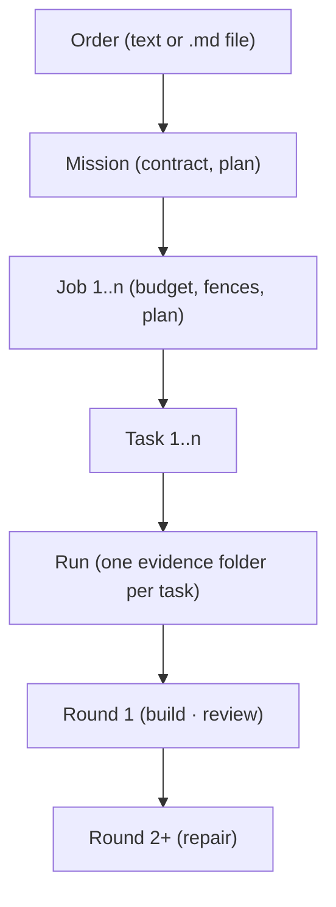

# T2_F259 — Vocabulary & concept model v1
**Tier 2 · Depends on: none · Blocks/used by: F260, F261 (both cite the page as binding), F263 (its command name), F268–F271 (their words)**

> Registered 2026-08-31 by operator order amend0831-vocab-registrations.
> Rewritten 2026-09-05 by operator order amend0905-vocab-rebuild (DECISION
> amend0905-vocab D1–D12 in `.agent/decisions.md`).
> REGISTRATION ONLY — nothing in this file has been implemented.

## Goal & Done
`docs/system/vocabulary.md` exists and is BINDING. It carries:

1. the D1 table verbatim — one row per word: the word, its one-sentence
   meaning, its code spelling TODAY → its code spelling after F260/F261, its
   CLI spelling, and what it is NOT. The words are Project, Order, Mission,
   Contract, Job, Plan, Task, Run, Round, Worker (roles Builder, Reviewer,
   Planner, Teacher), Decision, Evidence, Gate, Verdict, Roadmap;
2. a do-not-confuse table with exactly these rows: Job/Run · Plan/Roadmap ·
   Order/Job · Task/Round · Contract/permissions · Mission/schedule ·
   Worker/role · template/order file;
3. the concept diagram below as a Mermaid block;
4. DECISION amend0905-vocab D2–D10 as dated DECISION paragraphs with their
   reasoning, copied from `.agent/decisions.md` — the page is where a user
   reads them; the ledger is where they were decided.

The same diagram (Mermaid) goes into `README.md` directly under the
one-sentence description, and a short version of it, in REMEDY_EINSTIEG-grade
wording, into the page itself.

A docs test pins the BINDING words against `apps/cli/command_catalog.py`'s own
descriptions: a word marked binding appears with the page's meaning and no
competing synonym. The synonyms to assert ABSENT after F261 are: `promote`,
`flight plan`, `job-file`, `task-file`, `loop` as a group, `overnight`, and
`Worker:` as a role label. Until F261 lands, the test runs in a **planned** mode
against the page only; F261 switches it to **enforced**. That switch is a named
test parameter (`VOCABULARY_MODE = "planned" | "enforced"`, or an equivalent
module constant), never a skip marker.

Explicitly NO code. F259 decides words; F260 and F261 spend them and cite this
page as binding.

The diagram, in exactly this structure (Mermaid `flowchart TD`, English labels;
German labels are NOT used anywhere in the repo — the operator's German onboarding
document is generated from the page separately):

## Why this exists
The command tree, the data model and the docs each grew their own dialect.
Measured 2026-09-05: `remedy do` carries fifteen subcommands including `plan`,
`job-plan`, `job-run`, `job-promote` and `job-flow`; `job` carries twenty-eight,
among them `plan`, `run`, `run-next` and `run-loop`; `mission` carries `plan` too.
`packages/orchestration/data_paths.py` documents "TWO job stores" that mint two
id shapes. "Run" means a provider call in one module and a whole execution in
another; "flight plan" and "plan" name the same thing; "promote" names what a user
would call applying a result. Every feature that renames or merges something needs
a decided vocabulary to rename TO, or it invents a fourth dialect. The operator
decided the words on 2026-09-05 (D1); this feature writes them down where a user
and a test can read them.

## DECISIONs
The rulings below were made by the operator in amend0905-vocab-rebuild and are
recorded in `.agent/decisions.md`; this feature copies D2–D10 onto the page. Two
more are settled HERE, because the original registration of this feature left
them open:

### DECISION F259 D1 (2026-09-05, operator order amend0905-vocab-rebuild) — F263's command is `absorb`
The candidates were `absorb`, `sync`, `refresh`. `sync` claims a two-way
operation the feature does not perform (nothing flows from Remedy INTO the
human's edit); `refresh` describes the effect on a view, not on the evidence
chain. `absorb` says what happens: the human change is taken into the run as a
certified fact. F263 ships `remedy absorb`; T2_F263.md carries the final name.
Reverse by deleting this paragraph.

### DECISION F259 D2 (2026-09-05, operator order amend0905-vocab-rebuild) — `task-file` and `job-file` collapse into `order`
Today `remedy do --task-file` (`packages/orchestration/pingpong_loop.load_task_file`)
and the "job file" `packages/orchestration/pingpong_job.parse_job_file` parses are
two spellings of the same thing: a Markdown file a human hands Remedy. Under D1 that
thing is an Order. Both words are deleted; the file is "an order file" and the
argument is `remedy do <order>` where `<order>` is text or a `.md` path (D4). F261
performs the rename. Reverse by deleting this paragraph.

## Design
- The page lives at `docs/system/vocabulary.md` — built state, not roadmap,
  because from the moment it is written it describes what the words mean. It is
  registered in `docs/README.md`'s Quick-Find table and its System table.
- Shape per term, one table row: word · meaning · code spelling today (module or
  field, READ from the code in T001) · code spelling after F260/F261 (from D4/D6
  and T2_F260.md/T2_F261.md) · CLI spelling · is-not.
- The DECISION paragraphs sit on the page dated and with reasoning, so a later
  reader sees why and can reverse one by deleting it — and by deleting the same
  paragraph in `.agent/decisions.md`.
- The docs test (`tests/docs/test_vocabulary.py`) reads the shipped catalog — the
  `GROUPS` dict and `CATALOG` list of `apps/cli/command_catalog.py`, never a
  transcript — and the page. In **planned** mode it asserts the page carries every
  binding word, the do-not-confuse rows, the Mermaid block and D2–D10; in
  **enforced** mode it additionally asserts that no group or command description
  contains a retired synonym and that every binding word that appears in a
  description appears with the page's meaning (the page names, per word, the
  description fragments that count as its meaning).
- The README diagram is the same Mermaid text; the test pins README and page
  byte-equal on the block so they cannot drift.

## T001 — Write the page from the code as it is TODAY
Enumerate the terms from the code and CLI as they are on the day of the round
(read `packages/core/models.py`, `packages/orchestration/pingpong_job.py`,
`packages/orchestration/schemas/models.py`, `packages/orchestration/flight_plan.py`,
`packages/orchestration/mission_state.py`, `packages/orchestration/data_paths.py`
and the catalog; do not reconstruct them from memory), then write each row. The
"code spelling today" column is worthless if it is a guess. Fill the "after" column
from D4/D6 and the F260/F261 files. Add the do-not-confuse table, the diagram and
the D2–D10 paragraphs.

## T002 — Write the two settled rulings onto the page
DECISION F259 D1 and D2 above are ALREADY DECIDED by this amendment; T002 writes
them onto the page as dated DECISION paragraphs citing amend0905-vocab-rebuild, and
updates T2_F263.md's header if the H1 still carries a working name.

## T003 — The docs test, with red proof
`tests/docs/test_vocabulary.py` as described under Design, landing in planned
mode. Red proof: (a) remove one binding word from the page → the page assertion
fails; (b) flip the mode constant to enforced against today's catalog → the
synonym assertion fails on `do.promote`'s description (or whichever retired word the
catalog still carries that day), proving the enforced mode measures the catalog.
Both proofs are recorded with their raw output.

## T004 — README diagram and docs index registration
The Mermaid block into `README.md` directly under the one-sentence description
("Remedy is a local-first orchestration kernel …"), byte-equal to the page's block;
`docs/system/vocabulary.md` registered in `docs/README.md`.

## Acceptance
- `docs/system/vocabulary.md` exists, is registered in `docs/README.md`, and
  carries the D1 table (all fifteen words), the eight do-not-confuse rows, the
  Mermaid diagram and D2–D10.
- `README.md` carries the same Mermaid block under the one-sentence description.
- DECISION F259 D1 (`absorb`) and D2 (`order`) are on the page.
- `tests/docs/test_vocabulary.py` is green in planned mode, has a demonstrated red
  proof for both modes, and its mode is a named constant F261 flips.
- `docs/roadmap/features/T2_F260.md` and `T2_F261.md` cite the page as binding
  (they already do as of this rewrite; the acceptance re-checks the sentence).

## Do not touch
No command is renamed here, no module is moved, no data shape changes, no catalog
description is edited. A rename that happens in this feature is out of scope by
construction — F261 owns renames, F260 owns the data model.

## Orchestrator brief
T001 is the bulk of the work and is a READING task before it is a writing task;
T002 cannot be split from it. T003 is small but must be written against the
shipped catalog, never a hand-copied list of command names, and its enforced-mode
red proof is what makes F261's later flip meaningful. T004 last. Under the
amend0905-throughput default this feature fits one session.
