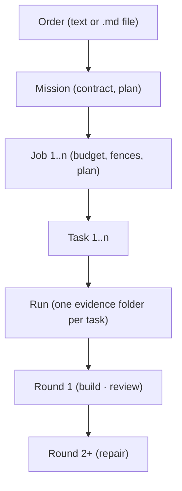

# Vocabulary — the words Remedy uses

> **BINDING.** These are the words. Every feature, every command description in
> `apps/cli/command_catalog.py` and every document under `docs/` uses them with
> the meaning given here, and uses no synonym for a word that already has one.
> The operator decided them on 2026-09-05 in order amend0905-vocab-rebuild,
> DECISION amend0905-vocab D1; F259 wrote them down. To change a word, change
> this page first.

## How to read the table

Two of the columns disagree on purpose. **Code spelling today** is what the
source really says right now — it was read out of the code, not remembered, and
`.agent/f259_inventory.md` holds the per-symbol citations it was taken from,
measured at commit `67598164`. **Code spelling after F260/F261** is a PLAN:
F260 rebuilds the data model and F261 performs the renames, and until they land
the two columns differ wherever the current code carries a word this page
retires. A reader who conflates them will think the page is wrong about the
code; it is not, it is about both the code and the decision.

The last column is the one that does the work. Most of the confusion this page
exists to end was not people failing to define a word — it was two words for one
thing, or one word for two things.

## The words

| Word | Meaning | Code spelling today | Code spelling after F260/F261 | CLI spelling | Is NOT |
|---|---|---|---|---|---|
| **Project** | The frame: one or more repos and every mission inside them. | `project_id` in `packages/core/models.py` and in `packages/orchestration/mission_state.py`, which also defines `mission_dir_for_project` and `project_ids_with_missions`; the store path is `projects_dir` in `packages/orchestration/data_paths.py` | unchanged | the `project` group: `create`, `list`, `show`, `attach-repo`, `attach-job`, `brain`, `context`, `summary`, `current`, `adopt` | — |
| **Order** | Everything the human gives Remedy: the initial text or file behind `remedy do`, and every later message during a run. | no symbol spells it; the same thing is carried under two other names — `parse_job_file`, `plan_job_from_file` and `job_file_sha256` in `packages/orchestration/pingpong_job.py`, and the `--job-file` and `--task-file` options in `apps/cli/command_catalog.py` | `order`; both option spellings are deleted and the argument becomes the positional `<order>`, text or a `.md` path (DECISION F259 D2) | none today; `do <order>` after F261 | the Job — the Order is the input, the Job is Remedy's response |
| **Mission** | What every Order becomes: one persistent record holding the Order, the Contract, the mission Plan and an ordered list of 1..n Jobs. | `Mission`, `MissionJobLink`, the `MISSION_STATUS_` and `MISSION_ROLE_` constants and the `Mission*Error` family, all in `packages/orchestration/mission_state.py` | unchanged as a type; a mission is created for EVERY order, which reverses F056's "a mission is never created automatically" (DECISION amend0905-vocab D2) | the `mission` group: `list`, `show`, `plan`, `contract`, `run`, `continue`, `pause`, `resume`, `achieve`, `abandon`, `start` | a schedule; a job |
| **Contract** | The acceptance criteria of a Mission, compiled to machine-checkable checks — its Definition of Done. One per mission; a job's contract is the derived slice for that job. | nothing in the seven sources spells this concept; its two halves are `PlannedTask.acceptance` in `packages/orchestration/schemas/models.py` and `packages/orchestration/dod_compiler.py`. The catalog's `contract` group today is a DIFFERENT concept wearing the word: the run-permission object, as `contract.inspect`, `contract.check` and `contract.set` | `contract` names the acceptance criteria and nothing else; the run-permission group is deleted and its idea folded into permissions and fences (DECISION amend0905-vocab D4) | `mission contract <id>` and `job contract <id>` after F261 | the run-permission object once called the "run contract" |
| **Job** | The administrative unit under a mission: identity, budget, fences, permissions, decisions, the job Plan with its Tasks, and references to its Runs. | the record and its parts are `Job`, `JobBudgets` and `JobFences` in `packages/core/models.py`; the plan and the state constants are `JobPlan`, `JOB_PLANNED`, `JOB_RUNNING`, `JOB_BLOCKED`, `JOB_COMPLETED`, `JOB_PAUSED` and `JOB_STOPPED` in `packages/orchestration/pingpong_job.py`. Two id shapes are minted from two stores, which `packages/orchestration/data_paths.py` documents in as many words: "Remedy has TWO job stores and they are shaped differently" | one store and one id shape (F260) | the `job` group | the Run |
| **Plan** | The ordered "what will be done" of a level: the mission plan lists the milestones, each of which becomes a job; the job plan lists the tasks. | two dialects side by side. `packages/orchestration/schemas/models.py` defines `FlightPlan`, `FlightPlanClarification`, `PlannerPlan`, `PlannedTask` and `FLIGHT_PLAN_SCHEMA_V`; `packages/orchestration/flight_plan.py` defines `FlightPlanResult` and `map_flight_plan_to_tasks`; and `packages/orchestration/pingpong_job.py` carries `JobPlan` beside them | `flight_plan.py` becomes `job_plan.py` and the noun "flight plan" is deleted from code, catalog, docs and feature files (DECISION amend0905-vocab D6) | `job plan` and `mission plan` are the only two plan commands; today's `plan status` and `plan next` become the hidden group `roadmap` | the Roadmap |
| **Task** | One step in a job plan; the planner chooses how many, bounded by configured maxima that are ceilings, not targets. | four spellings for one idea: `Task` in `packages/core/models.py`; `TaskEntry` in `packages/orchestration/pingpong_job.py`, alongside the `TASK_PENDING` to `TASK_SPLIT` state constants, `max_tasks` and the converters `task_entry_to_planned_task` and `planned_task_to_task_entry`; and `PlannedTask` and `ProposedTask` in `packages/orchestration/schemas/models.py` | one task type (F260) | no group of its own; it appears as `job run <id> --tasks n` and `job context <id> --task <t>` | a Round |
| **Run** | One execution of the ping-pong loop for exactly one Task, owning exactly one evidence folder. | `RunState` in `packages/core/models.py`; `run_id`, `run_job` and the `run_manifest_path`, `run_manifest_created_at` and `run_manifest_episodes` fields in `packages/orchestration/pingpong_job.py`; `runs_dir` in `packages/orchestration/data_paths.py`. The word also names a provider call in one place and a whole execution in another | `run` means the per-task execution and nothing else | `run show <id>` and `run list` after F261; today the verb is scattered across `job run`, `do run`, `mission run`, `loop run` and more | the verb; a dogfood run; the run manifest |
| **Round** | One pass inside a run: build, then tests, then review. Round 2 and later are repairs. | `max_rounds`, `max_rounds_source`, `repair_rounds_allowed`, `repair_rounds_used` and `repair_rounds_source` in `packages/orchestration/pingpong_job.py` | unchanged | none | a Task — a task can take several rounds |
| **Worker** | A model in a role. The roles are Builder, Reviewer, Planner and Teacher, and the list is extensible. | nothing spells the concept itself; the roles appear as the `builder_model` and `reviewer_model` fields in `packages/orchestration/pingpong_job.py` | unchanged as a type, but the report names the ROLE and never says "Worker: fake" for a builder (DECISION amend0905-vocab D1) | the `worker` group: `list`, `show`, `resources`, `unload`, `status`, `doctor` after F261 | — |
| **Decision** | A question Remedy cannot answer for itself, put to the human and answered with one command. | `HumanDecision` in `packages/orchestration/decision_queue.py`; the flight-plan approval path spells the same idea as `flight_plan_approval_open` and `resolve_flight_plan_approval` in `packages/orchestration/flight_plan.py` | the approval stays a Decision; the retired noun leaves its name with DECISION amend0905-vocab D6 | the `decision` group: `list`, `show`, `resolve`, `explain` | a DECISION paragraph in `.agent/decisions.md`, which is Remedy's own build record and not a user concept |
| **Evidence** | What one Run leaves behind: exactly one folder per task run, holding the inputs, the outputs and the proofs. | `build_evidence_bundle` in `packages/orchestration/pingpong_evidence.py`; `stream_evidence` and `job_evidence_dir` in `packages/orchestration/pingpong_job.py`; `mission_evidence_dir` in `packages/orchestration/mission_state.py`; `evidence_exports_dir` in `packages/orchestration/data_paths.py` | unchanged | `job evidence <id>` after F261; today `do evidence` and `do job-evidence` | the run manifest, which is one file inside the folder |
| **Gate** | A check that must pass before the work may proceed; it decides, and it records what it decided from. | `GateResult` in `packages/orchestration/dod_gate.py`, the only type under `packages/` named for the concept itself rather than for one particular gate; nothing in the seven sources spells it | unchanged | none | a Verdict — the gate is the check, the verdict is the Reviewer's judgement |
| **Verdict** | The Reviewer's judgement on one Round. | `Verdict` and `ReviewVerdict` in `packages/orchestration/schemas/models.py`, where `Verdict` is the literal set pass, fail, needs_repair, blocked; the field carrying it is `reviewer_verdict` in `packages/orchestration/pingpong_job.py` | unchanged | none | a Gate's result |
| **Roadmap** | Remedy's own build plan under `docs/roadmap/`; a developer tool, never a user concept. | nothing in the seven sources spells it; the ledger is the file `docs/roadmap/STATUS.md` | unchanged | today's `plan status` and `plan next` become the hidden group `roadmap` (DECISION amend0905-vocab D6) | a mission plan |

The seven sources the "code spelling today" column was read from are
`packages/core/models.py`, `packages/orchestration/pingpong_job.py`,
`packages/orchestration/schemas/models.py`,
`packages/orchestration/flight_plan.py`,
`packages/orchestration/mission_state.py`,
`packages/orchestration/data_paths.py` and `apps/cli/command_catalog.py`.
Where a cell names a module outside that list —
`packages/orchestration/decision_queue.py`,
`packages/orchestration/pingpong_evidence.py`,
`packages/orchestration/dod_gate.py` and
`packages/orchestration/dod_compiler.py` — it is because DECISION
amend0905-vocab D1 gave that word no table row and told F259 to write one from
the feature that owns the concept; they were found by searching every `.py`
file under `packages/` and under `apps/`.

## Do not confuse these

Most of what this page exists to end was never someone failing to define a word.
It was two words for one thing, or one word for two things.

| Not the same | The difference | Why they get confused |
|---|---|---|
| **Job / Run** | A Job is the administrative unit — identity, budget, fences, permissions, a plan. A Run is one execution of the loop for one Task, owning one evidence folder. One Job has many Runs. | Both carry an id and a status, and the command `job run` reads as though the job were the thing that runs. |
| **Plan / Roadmap** | A Plan is what Remedy will do for a mission or a job. The Roadmap is Remedy's OWN build plan under `docs/roadmap/`, a developer artefact no user ever sees. | The CLI today spells the roadmap mirror `plan status` and `plan next`, which is the sharpest collision in the tree; DECISION amend0905-vocab D6 moves it to the hidden group `roadmap`. |
| **Order / Job** | The Order is what the human gives Remedy. The Job is what Remedy makes of it. Input against response. | The order arrives as a file and the job is parsed straight out of it, so one phrase — "job file" — has been naming both ends at once. |
| **Task / Round** | A Task is one step of a job plan. A Round is one pass inside a single Run of a single Task: build, then tests, then review. A task that fails takes a second Round, never a second Task. | Both are counted and both are capped, and casual prose calls either one a "step". |
| **Contract / permissions** | The Contract is what the mission must ACHIEVE — acceptance criteria compiled to checks. Permissions and fences are what Remedy is ALLOWED TO DO while trying. Goal against boundary. | The catalog's `contract` group today is the permission object, not the acceptance criteria, so the word currently points at the wrong one of the two. |
| **Mission / schedule** | A Mission is one order and everything that came of it. It has no recurrence and no clock. | `remedy loop` and the `overnight` group made recurrence look like a property of a mission; DECISION amend0905-vocab D7 deletes both, and a recurring order becomes an order file started by hand. |
| **Worker / role** | A Worker is a model IN a role. The role is Builder, Reviewer, Planner or Teacher; the worker is whichever model is bound to that role for this task. | Reports have printed "Worker: fake", which names the provider in the place a reader expects the role. |
| **template / order file** | A template is a CONTRACT template — website, api-service, cli-tool, python-library — proposed by the planner or forced with `--contract`. An order file is a Markdown file holding one human's order, started with `remedy do <file>`. | Both are files you keep in the repo and hand to Remedy, and the deleted `loop` tables called order files templates. |

## The concept model

In words, for a first read. You give Remedy an **Order** — a sentence, or a
Markdown file. Remedy turns it into a **Mission**, the record of that order,
which holds the **Contract**: the acceptance criteria the finished work must
meet. The mission is carried out by one or more **Jobs**, and each job has its
own budget, its fences and its own **Plan** — and that plan is a list of
**Tasks**. Each task is executed by exactly one **Run**, which owns exactly one
evidence folder. Inside a run the work happens in **Rounds**: round 1 builds and
reviews, and every later round repairs.

Everything above the Run is bookkeeping. The Run is where a model actually
writes code, and the evidence folder it leaves behind is what you read
afterwards to see what happened.
